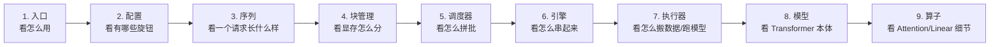

# 第 0 部分 · 导论：认识 nano-vllm，把它跑起来

> 🎯 **本篇目标**
> 1. 搞清楚 nano-vllm 到底是什么、值不值得花时间学。
> 2. 盘点你需要的前置知识（附自测清单）。
> 3. **亲手把它跑起来**——环境、依赖、模型下载、运行 `example.py` / `bench.py`。
> 4. 给出"先读哪个文件"的阅读路线图。
>
> 本篇偏实操，但每个工具我们都会讲清"为什么用它、它不可替代在哪"，而不是甩给你一堆 `pip install`。

---

## 0.1 这个项目是什么、为什么值得学

### 一句话定义

> **nano-vllm 是一个用约 1200 行 Python 从零实现的轻量级 LLM 推理引擎，复刻了工业级引擎 vLLM 的核心思想，推理速度还能打平官方。**

### 它和 vLLM 的关系

| | vLLM（工业级，几万行） | nano-vllm（教学级，~1200 行） |
|---|---|---|
| **覆盖面** | 生产可用、支持几十种模型、分布式、量化… | 只支持 Qwen3、单卡 / 多卡 |
| **代码** | 庞大复杂 | 干净可读 |

> **"提取精华"**：vLLM ──────────────▶ nano-vllm —— 保留了所有**核心思想**。

nano-vllm 不是 vLLM 的缩水版玩具，而是把 vLLM **最值钱的工程思想**（PagedAttention、Prefix Caching、Continuous Batching、Tensor Parallelism、CUDA Graph……）用最少的代码重新实现一遍。这些思想是通用的——理解了 nano-vllm，再去看 vLLM、SGLang、TensorRT-LLM 的源码，你会发现自己已经懂了八成。

### 学习价值清单

| 价值 | 说明 |
|---|---|
| 🧠 **AI Infra 全家桶一次学完** | PagedAttention、KV cache、连续批处理、张量并行、CUDA graph、flash attention、triton kernel、采样……都在 1200 行里 |
| 📖 **代码干净到能逐行读** | 没有抽象工厂工厂工厂，每个文件职责单一，适合精读 |
| ⚡ **能真的跑、真的快** | 不是玩具 demo，性能对标 vLLM，跑 bench 能验证 |
| 🔄 **触类旁通** | 学完看 vLLM/SGLang 源码毫无障碍，面试 AI Infra 岗位够用 |

### 适合谁

- ✅ 会 Python，想搞懂"大模型怎么高效部署"的人
- ✅ 用过 transformers 跑模型，但好奇 vLLM 为什么快那么多的人
- ✅ 准备面试 AI Infra / 推理优化岗位的候选人
- ⚠️ 需要一台 NVIDIA GPU（最低约 6–8 GB 显存，详见 0.3）

---

## 0.2 你需要的前置知识（附自测清单）

不用担心"我是不是基础不够"——本系列是面向零基础讲 AI Infra 的。但有些 **Python 进阶语法**和**一点点 Transformer 常识**会帮你读得更顺。

### ✅ 需要的 / ❌ 不需要的

| 需要 | 不需要（本系列会讲） |
|---|---|
| Python 基础（函数、类、列表字典） | 不需要精通 PyTorch（用到时讲） |
| 会用 `pip` 装包、跑 `python xx.py` | 不需要懂 CUDA 编程（triton 会讲） |
| 大致知道"Transformer 是个模型结构" | 不需要能手推反向传播 |
| 知道 GPU 能加速计算 | 不需要有分布式经验 |

### 📝 自测清单（能答对一半以上就够格）

> 这些概念在本系列里**都会讲到**，这里只是帮你定位起点。不会也没关系，标出来，学到时多留意。

- [ ] 知道 `@dataclass`、`@property`、`@classmethod` 这些装饰器大概干嘛
- [ ] 知道 `__len__`、`__getitem__` 这种"双下划线方法"的作用
- [ ] 听说过"注意力机制 Attention"这个词
- [ ] 知道"token"是什么、为什么文字要变成数字给模型
- [ ] 用过 `git clone` 和命令行
- [ ] 大致理解"显存"和"内存"的区别

> 全不会？也完全 OK——本系列就是为你写的。你只需要**愿意边读边查**。

---

## 0.3 把它跑起来

### 0.3.1 硬件要求

| 项目 | 最低 | 推荐（对标官方 bench） |
|---|---|---|
| GPU | NVIDIA GPU，≥ 6 GB 显存 | RTX 4070 Laptop / 8 GB |
| CUDA | ≥ 11.8（torch 能用即可） | 匹配你显卡驱动的版本 |
| 内存 | ≥ 8 GB | 16 GB+ |
| 模型 | Qwen3-0.6B（约 1.2 GB） | 同左 |

> 💡 为什么选 Qwen3-0.6B？因为它小（0.6B 参数），普通笔记本显卡也能跑；同时结构完整（带 GQA、RoPE、SwiGLU、q/k_norm），是个"麻雀虽小五脏俱全"的教学模型。

### 0.3.2 依赖一览：每个库都在干嘛、为什么不可替代

打开 [`pyproject.toml`](../pyproject.toml)，依赖只有 5 个，但每一个都"身怀绝技"：

| 依赖 | 它是什么 | 在 nano-vllm 里干嘛 | 出现在 | 为什么不可替代 |
|---|---|---|---|---|
| **torch** ≥2.4 | PyTorch 深度学习框架 | 定义模型、张量运算、CUDA 调度、`torch.compile`、CUDA Graph | 几乎所有文件 | 它就是"算"的底盘 |
| **triton** ≥3.0 | OpenAI 的 GPU kernel 语言 | 写 `store_kvcache` 自定义 kernel，把 K/V 存进分页 cache | [`layers/attention.py`](../nanovllm/layers/attention.py) | 让你能用 Python 语法写接近手写 CUDA 性能的 kernel，不必学 CUDA C |
| **transformers** ≥4.51 | HuggingFace 的 NLP 库 | 加载 tokenizer 和模型 config（**不**用于加载权重） | [`config.py`](../nanovllm/config.py) · [`llm_engine.py`](../nanovllm/engine/llm_engine.py) | 提供统一的 tokenizer 和 config 接口，省得自己解析 vocab |
| **flash-attn** | Flash Attention 库 | 高效的变长 attention：`flash_attn_varlen_func` / `flash_attn_with_kvcache` | [`layers/attention.py`](../nanovllm/layers/attention.py) | IO 友好的 attention，省显存又快（第 2 部分会深挖原理） |
| **xxhash** | 极速非加密哈希 | 给 KV cache 的 block 打"指纹"，实现 Prefix Caching | [`engine/block_manager.py`](../nanovllm/engine/block_manager.py) | 比加密哈希（如 hashlib 的 sha256）**快一个数量级**，prefix matching 是热路径 |

> 🔬 **两个"为什么"深挖**（这是本篇的硬核小菜）：
>
> **Q：为什么用 `safetensors` 读权重（[`utils/loader.py`](../nanovllm/utils/loader.py)），而不是 `torch.load`？**
> A：`torch.load` 读的是 pickle，有两个致命问题——① **不安全**：pickle 可在加载时执行任意代码（下载来路不明的权重等于运行未知程序）；② **慢**：pickle 反序列化要创建大量 Python 对象。`safetensors` 是专门为模型权重设计的格式：**安全**（只存张量数据，不能执行代码）、**快**（零拷贝 mmap 加载）、**支持懒加载**（可只读某个张量而不读整个文件）。这也是 HuggingFace 如今默认用它的原因。
>
> **Q：为什么 prefix caching 用 `xxhash` 而不是 `hashlib.sha256`？**
> A：每次 decode 一步，调度器都可能要给若干 block 计算哈希（[`block_manager.py:compute_hash`](../nanovllm/engine/block_manager.py)）。这是**热路径**，哈希函数必须极快。xxhash 是非加密哈希，设计目标就是"最快"——它不保证抗碰撞安全，但 prefix matching 只需要"相同内容 → 相同哈希"，不需要抗恶意伪造，所以用最快的那个。sha256 每次都要做几十轮加密运算，慢得多，在这个场景纯属浪费。

### 0.3.3 安装步骤

```bash
# 1) 拿到代码
git clone https://github.com/GeeeekExplorer/nano-vllm.git
cd nano-vllm

# 2) （建议）建个独立环境
python -m venv .venv && source .venv/bin/activate

# 3) 按 CUDA 版本装 torch（去 https://pytorch.org 复制对应命令），例如 CUDA 12.1:
pip install torch --index-url https://download.pytorch.org/whl/cu121

# 4) 装其余依赖
pip install triton transformers xxhash

# 5) 装 flash-attn（⚠️ 这步最容易踩坑，见下方说明）
pip install flash-attn --no-build-isolation
```

> ⚠️ **flash-attn 安装坑（重要）**
> flash-attn 需要**从源码编译**，所以：
> - 它很慢（可能 10–30 分钟），别中途以为卡死了。
> - 必须加 `--no-build-isolation`，否则它会在隔离环境里找不到你已经装好的 torch。
> - torch / CUDA / gcc 版本要匹配。装不上时，先确认 `nvcc --version` 和 torch 编译时的 CUDA 版本一致。
> - 实在编不动，可以 `pip install flash-attn --no-build-isolation --no-cache-dir`，或去 [flash-attn releases](https://github.com/Dao-AILab/flash-attention/releases) 找预编译 wheel 对应你的 torch+CUDA+Python 版本。
>
> flash-attn 没有替代方案：attention 计算始终依赖它的 kernel，装不上就跑不了 `example.py`。注意 `enforce_eager=True` 只控制是否跳过 CUDA Graph 录制，与 flash-attn 无关。

### 0.3.4 下载模型权重

```bash
# 方式 A：官方（需能访问 huggingface.co）
huggingface-cli download Qwen/Qwen3-0.6B --local-dir ~/huggingface/Qwen3-0.6B/

# 方式 B：国内镜像（hf-mirror），速度快很多
HF_ENDPOINT=https://hf-mirror.com huggingface-cli download Qwen/Qwen3-0.6B --local-dir ~/huggingface/Qwen3-0.6B/
```

下载完后，目录里应该有：`config.json`、`*.safetensors`（权重）、`tokenizer.json` 等。

### 0.3.5 跑 example.py

把 [`example.py`](../example.py) 里的路径改成你刚下载的：

```python
path = os.path.expanduser("~/huggingface/Qwen3-0.6B/")
```

然后：

```bash
python example.py
```

**预期输出**（大致，具体内容取决于模型和采样）：

```
Generating: 100%|██████████| 2/2 [00:0X<00:00, ...]


Prompt: '<|im_start|>user\nintroduce yourself<|im_end|>\n<|im_start|>assistant\n'
Completion: 'I am Qwen, a large language model developed by ...'


Prompt: '<|im_start|>user\nlist all prime numbers within 100<|im_end|>\n<|im_start|>assistant\n'
Completion: 'The prime numbers within 100 are: 2, 3, 5, 7, ...'
```

> 💡 看到 `Generating` 进度条和 `Prefill`/`Decode` 的 tok/s 后缀了吗？那就是 [第 1 部分](01-全局视角.md)讲的"Prefill 阶段"和"Decode 阶段"的实时吞吐。

### 0.3.6 跑 bench.py 对比性能

```bash
python bench.py
```

它会生成 256 条随机请求，测吞吐。结尾输出类似：

```
Total: 133966tok, Time: 93.41s, Throughput: 1434.13tok/s
```

可以和官方 vLLM 跑同样负载对比（README 里有对照表）——你会看到 nano-vllm 用 1/20 的代码量达到了接近甚至超过官方的吞吐。**这就是它"值得学"的硬证据**。

---

## 0.4 阅读路线图：先读哪个文件？

直接从 `model_runner.py` 开始读会被劝退。推荐这个"从外到内、从简单到复杂"的顺序：



> 🗺️ **这张图怎么读**：从左到右的 9 个方框，是建议你**阅读源码的顺序**，箭头表示"读完这个再读下一个"。
>
> - **从外到内**：先从最外层的"入口"（怎么调用）开始，一步步深入到最内层的"算子"（一个矩阵乘怎么算）。就像先看清一栋楼的大门和楼层布局，再进每个房间看细节。
> - **从简到繁**：第一个文件只有 5 行，用来热身；最复杂的文件放到你已经建立全局认知之后再啃，才不会被劝退。
> - **为什么按这个顺序**：nano-vllm 的核心价值在"调度 + 显存管理"而非"算模型"。先理解请求怎么流转、显存怎么分配（前 6 步），再去看模型本体和算子（后 3 步），才不会一头扎进数学细节却不知道它在整个流程里的位置。
>
> 下方表格把每一步对应的具体文件和"为什么这时读"列了出来，可对照着看。

| 顺序 | 文件 | 为什么这时读 |
|---|---|---|
| 1 | [`__init__.py`](../nanovllm/__init__.py) · [`llm.py`](../nanovllm/llm.py) | 5 行，先知道对外接口长啥样 |
| 2 | [`config.py`](../nanovllm/config.py) · [`sampling_params.py`](../nanovllm/sampling_params.py) | 知道有哪些可调参数 |
| 3 | [`engine/sequence.py`](../nanovllm/engine/sequence.py) | 理解"一个请求"的数据结构 |
| 4 | [`engine/block_manager.py`](../nanovllm/engine/block_manager.py) | 理解 KV cache 怎么分页（最难但最核心） |
| 5 | [`engine/scheduler.py`](../nanovllm/engine/scheduler.py) | 理解怎么调度拼批 |
| 6 | [`engine/llm_engine.py`](../nanovllm/engine/llm_engine.py) | 把 3-5 串起来 |
| 7 | [`engine/model_runner.py`](../nanovllm/engine/model_runner.py) | 最长最复杂，搬数据/跑模型/采样的总指挥 |
| 8 | [`models/qwen3.py`](../nanovllm/models/qwen3.py) | 标准 Transformer 结构 |
| 9 | [`layers/*.py`](../nanovllm/layers/) | 各算子细节 |

> 📚 **和本系列的配合**：本系列第 1 部分（[全局视角](01-全局视角.md)）帮你建立地图；第 2 部分讲理论；第 3 部分讲 Python 语法；**第 4 部分会严格按上面这个顺序逐文件精讲**。所以你也可以先读第 4 部分，边读边对着源码看。

---

## 0.5 代码目录树速览

```
nano-vllm/
├── example.py                 # 怎么用（离线推理示例）
├── bench.py                   # 性能测试
├── pyproject.toml             # 依赖与打包配置
├── README.md
└── nanovllm/                  # ← 核心代码全在这
    ├── __init__.py            # 对外暴露 LLM / SamplingParams
    ├── llm.py                 # LLM 类（继承自 LLMEngine）
    ├── config.py              # Config 配置
    ├── sampling_params.py     # 采样参数
    │
    ├── engine/                # ── 引擎层（调度 + 显存管理）
    │   ├── llm_engine.py      #    总指挥
    │   ├── sequence.py        #    一个请求的档案
    │   ├── scheduler.py       #    调度器
    │   ├── block_manager.py   #    KV cache 分页管理
    │   └── model_runner.py    #    执行器（搬数据/跑模型/CUDA graph）
    │
    ├── models/                # ── 模型层
    │   └── qwen3.py           #    Qwen3 Transformer
    │
    ├── layers/                # ── 算子层
    │   ├── attention.py       #    Flash Attention + triton 存 KV
    │   ├── linear.py          #    各种并行 Linear
    │   ├── rotary_embedding.py#    RoPE 旋转位置编码
    │   ├── embed_head.py      #    Embedding / LM Head
    │   ├── layernorm.py       #    RMSNorm
    │   ├── activation.py      #    SiLU 激活
    │   └── sampler.py         #    采样
    │
    └── utils/                 # ── 工具层
        ├── context.py         #    全局上下文（传递 attention 参数）
        └── loader.py          #    权重加载
```

---

## 本篇小结

到这里你应该：

1. **理解了** nano-vllm 是什么、为什么值得学（1200 行讲透 AI Infra 核心）。
2. **盘点完**前置知识，知道自己的起点在哪。
3. **亲手跑起来**了 `example.py` 和 `bench.py`（如果遇到环境问题，回头查 0.3.3 的坑）。
4. **知道了**阅读顺序和目录结构。

### 📍 你现在在哪

```
[第0部分 导论] ✅你在这里 ➜ [第1部分 全局视角] ⬅️ 下一篇 ➜ [第2部分 AI Infra 理论] ➜ [第3/4/5部分]
```

> **下一篇预告**：第 1 部分建立**全局视角**——用一张图看懂三层架构、跟踪一次请求的完整旅程、把所有"黑话"翻译成人话。这是后面所有章节的地图，强烈建议从这里进入。

---

> 📌 如果你已成功跑通 `example.py`，就可以放心往下读了——后面所有理论都能在这份代码里找到对应实现。
