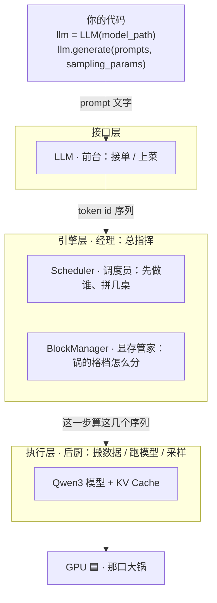
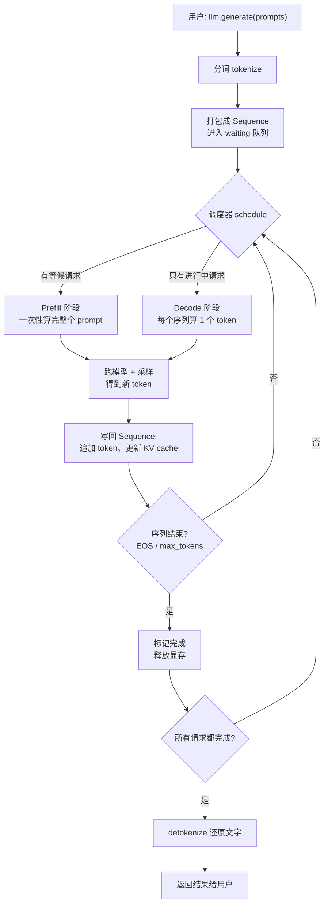
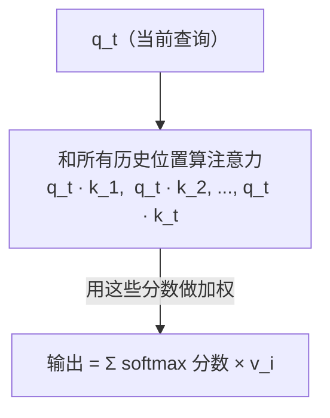
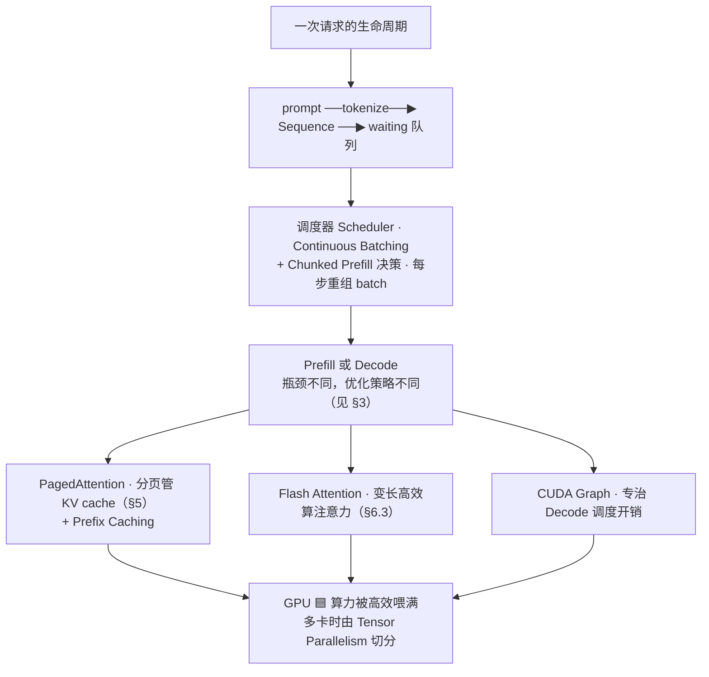

# 第 1 部分 · 建立全局视角：nano-vllm 是怎么运转的

> 🎯 **本篇目标**：先不碰代码细节，在脑子里建起一张牢固的"地图"。读完这篇，你不仅能回答"这个项目分几层、一次请求怎么走完"，还能理解**为什么**推理引擎要长成这样——KV Cache 凭什么能省几十倍计算？PagedAttention 为什么叫"虚拟内存"？Continuous Batching 到底比静态拼批快在哪？
>
> 篇幅故意拉长，因为我们把每个核心概念都挖到了"原理直觉"这一层。慢一点没关系，这一篇是后面所有章节的地基。

---

## 0. 先定位：nano-vllm 在 AI 世界里是什么角色

在理解 nano-vllm 之前，先搞清楚一个大背景：**训练 vs 推理**。

> **造模型的一生**

| | 训练 Training | 推理 Inference / Serving |
|---|---|---|
| **做什么** | 用海量数据教会模型 → 产出"权重文件" | 把训练好的模型部署出去 → 给真实用户的请求算答案 |
| **特点** | 算力无底洞、要海量 GPU、动辄几千卡、训几个月 | 要**快**、要**省显存**、同时服务很多人、毫秒级响应 |
| **工具** | PyTorch / Megatron / DeepSpeed | vLLM / TGI / TensorRT-LLM / **nano-vllm** |

> 📌 nano-vllm 是一个 **推理引擎（Inference Engine / Serving Engine）**。它的任务**不是**训练模型，而是：拿到一个已经训练好的模型权重（比如 Qwen3-0.6B），高效地给一批用户请求算出答案。

### 为什么需要一个"引擎"，而不是直接 `model(input)`？

你当然可以用最朴素的 PyTorch 写一个生成循环：

```python
# 最朴素的推理（反面教材）
while not done:
    logits = model(all_tokens_so_far)   # 每次把所有 token 重新算一遍！
    next_token = sample(logits[-1])
    all_tokens_so_far.append(next_token)
```

这样能跑，但**慢得离谱、显存炸裂**，而且无法同时服务多个用户。推理引擎的存在，就是为了把这件事做得又快又省又稳。nano-vllm 用 **~1200 行代码**复刻了工业级引擎 vLLM 的核心思想，性能还能打平官方——这就是它的学习价值：**用最小的体积，讲清最精华的工程智慧**。

---

## 1. 一个类比贯穿全局：把 nano-vllm 想象成一家"高并发自助餐厅"

这个类比会贯穿全篇，请认真读。

想象一家生意爆棚的自助餐厅，客人源源不断点菜，后厨只有一口大锅（GPU）。怎么高效服务所有人？这家餐厅分三个部门：

| 餐厅部门 | nano-vllm 对应 | 职责 | 关键问题 |
|---|---|---|---|
| 🧑‍💼 **前台** | **接口层** `LLM` | 接单（prompt）、上菜（输出文本） | 给用户一个简单好用的接口 |
| 📋 **经理 + 调度员** | **引擎层** `Scheduler` / `BlockManager` | 决定先做哪个单、哪几单拼一锅、锅满了怎么办 | **怎么调度才不浪费锅** |
| 👨‍🍳 **后厨 + 大锅** | **执行层** `ModelRunner` + 模型 | 真正做菜（把 token 喂进 Transformer 算） | 怎么算得快、搬数据不卡 |

> 💡 **本篇最重要的认知**：在 LLM 推理里，**"怎么算"（模型本身）不是最难的，"怎么调度 + 怎么管显存"才是**。nano-vllm 一大半代码（`scheduler.py` / `block_manager.py` / `model_runner.py` 的前半部分）都在解决"调度"和"显存"，而不是"算"。

### 三层架构的代码地图

| 层 | 文件 | 一句话职责 |
|---|---|---|
| **接口层** | [`nanovllm/llm.py`](../nanovllm/llm.py) · [`__init__.py`](../nanovllm/__init__.py) | 对外暴露 `LLM` 和 `SamplingParams` |
| **引擎层** | [`llm_engine.py`](../nanovllm/engine/llm_engine.py) | 总指挥：管 tokenizer、scheduler、model_runner |
| | [`scheduler.py`](../nanovllm/engine/scheduler.py) | 调度器：决定这一步算哪些序列、算多少 token |
| | [`block_manager.py`](../nanovllm/engine/block_manager.py) | 显存管家：管理 KV cache 的分块 |
| | [`sequence.py`](../nanovllm/engine/sequence.py) | 一个请求的"档案袋" |
| **执行层** | [`model_runner.py`](../nanovllm/engine/model_runner.py) | 数据搬上 GPU、跑模型、采样、CUDA graph |
| | [`models/qwen3.py`](../nanovllm/models/qwen3.py) | Transformer 模型本体 |
| | [`layers/*.py`](../nanovllm/layers/) | Attention / Linear / RMSNorm 等积木 |

### 架构全景图



> 🏗️ **这张图怎么读**：从上到下是**一次请求的数据流动方向**；三个带框的分组（接口层 / 引擎层 / 执行层）是三层架构；箭头上的文字是"上一层交给下一层的东西"。
>
> - **你的代码** → 把一句 prompt 文字交给**接口层**。
> - **接口层（`LLM`，前台）**：负责"接单 / 上菜"。它把文字切成 token id 转交引擎，最后把生成好的文字还给你，不关心内部怎么调度。
> - **引擎层（`LLMEngine`，经理）**：总指挥，手下两个员工——`Scheduler`（调度员：决定这一步先算哪几个请求、拼成一桌）和 `BlockManager`（显存管家：决定 KV cache 这口大锅的格档怎么分）。
> - **执行层（`ModelRunner`，后厨）**：拿到"这一步算这几个序列"的指令，把数据搬上 GPU、跑 Qwen3 模型、采样出新 token。
> - **GPU 🟦（大锅）**：真正干活的硬件；多卡时还会被 Tensor Parallelism 切分。
>
> 🍳 **餐厅类比**：你是顾客 → 前台（接口层）接单 → 经理（引擎层）排桌派活 → 后厨（执行层）炒菜 → 灶台（GPU）出火。每层只管自己那摊事、互不越界——这就是下面要讲的"关注点分离"。

### 🤔 为什么这样分层？（关注点分离）

这三层是经典的**关注点分离（Separation of Concerns）**：

- **接口层**只关心"用户用着爽不爽"——不知道内部怎么调度。
- **引擎层**只关心"怎么高效"——不知道模型内部长什么样，只把它当黑盒调用。
- **执行层**只关心"算对、算快"——不知道外面有多少请求在排队。

这样分层的好处：换模型（Qwen3→Llama）只动执行层；换调度策略只动引擎层；用户接口永远不变。这也是为什么 vLLM 能支持几十种模型——接口和调度是通用的。

---

## 2. 数据流全景：一次请求的完整旅程

光看框图太抽象。我们来**跟踪一个具体的请求**，看它从进到出经历了什么。假设：

```python
llm = LLM("/path/to/Qwen3-0.6B", enforce_eager=True)
outputs = llm.generate(["Hello, Nano-vLLM."], SamplingParams(temperature=0.6, max_tokens=256))
```

### 阶段一：接单与分词

1. **`generate()` 被调用** → 实际是 [`LLMEngine.generate()`](../nanovllm/engine/llm_engine.py)，逐个把 prompt 交给 `add_request()`。
2. **分词（tokenize）**：`"Hello, Nano-vLLM."` 被 tokenizer 切成数字序列，比如 `[15496, 11, 3823, ...]`。**计算机只认数字**，文字必须先变成 token id。（这里的 id 值只是示意，套用的是 GPT 风格词表；Qwen3 自己的 BPE 词表切分粒度和编号都不同，真实跑出来的 id 会是另一串数字，但"文字→数字序列"这件事不变。）
3. **打包成 `Sequence`**：这串数字 + 采样参数，被打包成一个 [`Sequence`](../nanovllm/engine/sequence.py) 对象——一个**贴了编号的档案袋**，装着这个请求从生到死的全部信息。
4. **进入等候区**：档案袋丢进调度器的 `waiting` 队列。

### 阶段二：Prefill（预填充）——第一次下锅

模型必须先"读"完整句 prompt 才能开始往下写。这一步叫 **Prefill**。

5. **调度器决策**：从 `waiting` 取出该序列，让 `BlockManager` 分配显存块（存 KV cache），并告诉后厨"算这个序列的全部 prompt token"。
6. **后厨准备数据**：[`ModelRunner.prepare_prefill`](../nanovllm/engine/model_runner.py) 把 token id、位置、显存槽位映射等打包成 GPU 张量。
7. **跑模型**：Transformer 一口气吞下整个 prompt，吐出"下一个 token 的概率分布"。
8. **采样**：按概率分布 + temperature 挑出下一个 token（比如生成 `Hello`）。
9. **写回档案袋**：新 token 追加进 `Sequence`，状态从"等候 WAITING"变成"进行中 RUNNING"。

### 阶段三：Decode 循环——一个 token 一个 token 地吐

Prefill 之后进入生成模式：**每次只喂上一步生成的 1 个 token，预测下一个**，循环到 EOS 或 `max_tokens`。

10. **再调度**：调度器把所有"进行中"的序列拿来，每个贡献 1 个 token，**拼成一个 batch** 一起算。
11. **后厨算 1 步**：每个序列用自己已有的 KV cache + 新 token，算出下一个 token。
12. **采样 + 写回**：每个序列各自拿到新 token。
13. **检查是否结束**：到 EOS 或 max_tokens 就标记 FINISHED 并释放显存。

### 阶段四：上菜

14. 所有序列结束后，`generate()` 把 token id 用 tokenizer **还原成文字（detokenize）**，按请求顺序返回。

### 全流程流程图



> 🔁 **这张图怎么读**：这是**一次 `llm.generate()` 调用的完整生命循环**。方框是"动作"，菱形 `{ }` 是"判断分叉"，带文字的箭头是"满足什么条件走这条路"，绕回来的箭头是"循环"。
>
> - **开头（一次性准备）**：用户调用 → 分词 → 打包成 `Sequence` 进入 `waiting` 队列。
> - **循环核心**：调度器每一步二选一——有等候请求就先做 **Prefill**（把整个 prompt 一次性算完）；只有进行中请求就做 **Decode**（每个序列再往后算 1 个 token）。
> - **算完一步**：跑模型 + 采样得到新 token → 写回序列（追加 token、更新 KV cache）。
> - **两个判断菱形**构成循环：这条序列结束了吗（遇到结束符或达到 max_tokens）？所有请求都做完了吗？只要还有人没完工，就回到调度器继续转。
> - **出口**：全部完成后，把 token id 反解（detokenize）成文字返回给用户。
>
> 💡 看懂这张循环，就懂了推理引擎的主循环骨架：**它不是一次性算完所有请求，而是"调度 → 算一步 → 检查 → 再调度"地转圈**，直到所有人完工。

---

## 3. 深入：Prefill vs Decode —— 用数学钉死"为什么必须分两阶段"

这是理解后面所有优化的**关键直觉**。Prefill 和 Decode 的"干活节奏"截然不同。这次我们用严格的数学把它说死，而不是停留在"感觉很不一样"。

### 3.1 Scaled Dot-Product Attention：一切的基础

Transformer 的核心运算是 **scaled dot-product attention**。给定查询矩阵 $Q$、键矩阵 $K$、值矩阵 $V$：

$$
\text{Attention}(Q, K, V) \;=\; \text{softmax}\!\left(\frac{Q K^{\top}}{\sqrt{d}}\right) V
$$

其中 $d$ 是单个注意力头的维度（head_dim），$\sqrt{d}$ 是缩放因子——防止内积过大把 softmax 推进梯度饱和区。

约定张量形状（单个注意力头）：

- $Q \in \mathbb{R}^{N_q \times d}$：本步有 $N_q$ 个查询位置
- $K,\, V \in \mathbb{R}^{N_k \times d}$：要被"回顾"的 $N_k$ 个历史位置

> 👉 **关键事实**：要算出某个位置的输出，那个位置的 $Q$ 必须和**之前所有位置**的 $K, V$ 做点积。这就是"每生成一个 token 都得回顾全部历史"的数学根源。



> 🔍 **这张图怎么读**：它回答了一个核心问题——**"每生成一个新 token，模型到底在干什么？"** 答案是：拿当前 token 当"查询"，去和**之前所有历史 token**两两比对，再综合出输出。
>
> - **`q_t`（当前查询）**：正在生成的第 t 个 token，化身成一个"提问向量"：『谁跟我最相关？』
> - **中间这一步**：`q_t` 依次和历史位置 `k_1, k_2, ..., k_t` 做点积，得到一串"相关度分数"。
> - **加权求和**：把分数过一遍 softmax（变成加起来等于 1 的权重），再用权重去混合所有历史位置的 `v_i`（值向量），得到最终输出。
>
> 🍳 **类比**：像写文章时每写一个字，都会"回顾"前面所有内容，判断哪些跟现在最相关（打分），再把相关信息揉进来（加权）——这正是 **attention（注意力）** 的含义。
>
> ⚠️ 关键代价：t 越大要回顾的历史越多 → 这正是后面 KV cache、PagedAttention 要解决的"翻历史太慢"问题。

### 3.2 FLOPs 估算：attention 到底烧多少浮点运算

一次矩阵乘 $A \in \mathbb{R}^{m\times k} \times B \in \mathbb{R}^{k\times n}$，浮点运算量约为 $2mkn$（每个输出元素做 $k$ 次乘 + $(k{-}1)$ 次加 $\approx 2k$，共 $mn$ 个输出元素）。

把它套到 attention 的两个矩阵乘上：

| 运算 | 形状 | FLOPs |
|---|---|---|
| $Q K^{\top}$ | $(N_q,d)\times(d,N_k)$ | $2\,N_q N_k d$ |
| $\text{softmax}(\cdot)\,V$ | $(N_q,N_k)\times(N_k,d)$ | $2\,N_q N_k d$ |
| **单头单层 attention 合计** | | $\approx 4\,N_q N_k d$ |

> 说明：每层除 attention 外还有 QKV 投影、输出投影、MLP 的线性层，量级约 $O(\text{token数}\cdot d^2)$。但区分 compute/memory-bound 的关键是 attention 部分，我们聚焦它。

### 3.3 Prefill：N_q = N_k = L，计算量随长度平方爆炸

Prefill 一次性吃下长度为 $L$ 的整个 prompt，故 $N_q = N_k = L$：

$$
\text{Prefill attention FLOPs} \;\approx\; 4\,L^{2}\,d
$$

这是关于序列长度的**二次**增长——$L$ 翻倍，attention 计算量翻 4 倍。但全是规整的大矩阵乘，GPU 的 Tensor Core 满载。

- **餐厅类比**：一次性炒一大锅饭，灶火全开，效率拉满。

### 3.4 Decode：N_q = 1，算得少却要翻 t 页历史

Decode 每步只生成 1 个新 token，故 $N_q = 1$；而要回顾的历史长度 $N_k = t$（当前序列长度）：

$$
\text{Decode attention FLOPs (每步)} \;\approx\; 4 \cdot 1 \cdot t \cdot d \;=\; 4\,t\,d
$$

计算量看似不大。**致命的是访存**——每步都得把 $t$ 个历史位置的 $K, V$ 从显存读出来。每步要搬运的字节数：

$$
\text{Decode 每步访存} \;\approx\; \underbrace{2}_{K,V} \times n_{\text{layer}} \times t \times n_{\text{kv\_head}} \times d_{\text{head}} \times b
$$

（$b$ 是每个数值的字节数，bf16 时 $b=2$。）

- **餐厅类比**：每次只盛一勺饭，但勺子要在"历史账本"（KV cache）里翻 $t$ 页——翻账本（访存）才是瓶颈，灶火（算力）闲着。

### 3.5 算术强度 & Roofline：用一个比值钉死结论

光说"计算多、访存多"还不够硬核。判断一个运算到底卡在**算力**还是**带宽**，靠的是一个核心比值——**算术强度（Arithmetic Intensity）**：

$$
\text{算术强度} \;=\; \frac{\text{FLOPs（浮点运算量）}}{\text{Bytes（显存搬运量）}} \quad [\text{FLOPs/Byte}]
$$

GPU 有两个物理上限：

- 峰值算力 $P$（FLOPs/s）：算得多快
- 显存带宽 $B$（Bytes/s）：搬得多快

它们的比值 $P/B$ 叫 **屋脊点（ridge point）**。判据是：

$$
\frac{\text{算术强度}}{P/B} \;\begin{cases} \;\gg 1 & \Rightarrow\ \text{compute-bound（算力瓶颈，GPU 满载）} \\[4pt] \;\ll 1 & \Rightarrow\ \text{memory-bound（带宽瓶颈，GPU 闲置）} \end{cases}
$$

代入真实硬件 **A100 80G** 感受差距：

| 指标 | A100 (FP16) |
|---|---|
| 峰值算力 $P$ | $\approx 312$ TFLOPS |
| 显存带宽 $B$ | $\approx 2.0$ TB/s |
| **屋脊点 $P/B$** | $\approx 156$ FLOPs/Byte |

- **Prefill**：大矩阵乘，每读 1 字节约做数百次运算 → 算术强度远高于 156 → **compute-bound** ✅
- **Decode**：每读一大坨 KV 才做一点点运算 → 算术强度只有个位数 → **memory-bound** ✅

> 🎯 **这就是两阶段必须区别对待的根因**：Prefill 的敌人是"算力上限"，优化方向是高效大矩阵乘（Flash Attention）；Decode 的敌人是"启动开销"和"算力闲置"，优化方向是 **CUDA Graph**（省调度开销）+ **拼大 batch**（把多个序列的计算堆在一起喂饱算力）。后面每一项技术都能归到这两个敌人之一。

### 3.6 对比一览表

| 维度 | Prefill | Decode |
|---|---|---|
| 每步处理 token 数 | 很多（整个 prompt） | 1 个 |
| attention FLOPs | $\approx 4L^2 d$（随长度平方） | $\approx 4td$（每步） |
| 每步访存 | 读 prompt 本身（相对小） | 读全部历史 KV（随 $t$ 线性增长） |
| 算术强度 | 高 | 低（个位数） |
| 瓶颈类型 | **compute-bound** | **memory-bound** |
| GPU 算力利用率 | 高 ✅ | 低 ❌ |
| 对应优化思路 | 大矩阵高效算（Flash Attention） | CUDA Graph + 拼大 batch |

> 🔑 **这张表是全篇的"题眼"**。后面你会看到：
> - 为什么 nano-vllm 在 Decode 阶段用 **CUDA Graph**（每步计算简单但启动开销相对大，录制回放能省掉开销）。
> - 为什么 Decode 要**把多个序列拼成一个 batch**（单序列算量太小，拼起来才能喂饱 GPU 算力）。
> - 为什么 Prefill/Decode 的数据准备函数是分开的（[prepare_prefill](../nanovllm/engine/model_runner.py) vs [prepare_decode](../nanovllm/engine/model_runner.py)）。
>
> 遇到任何优化技术，先回来问一句"它针对的是 Prefill 还是 Decode 的哪个瓶颈？"——立刻清晰。

---

## 4. 深入：KV Cache —— 推理引擎存在的第一理由

KV Cache 是理解整个项目的**基石中的基石**。我们把它讲透。

### 4.1 没有 KV Cache 会怎样？（痛苦版）

回到 3.1 的事实：**预测第 t 个 token 需要用到之前所有位置的 K、V**。

如果不缓存，朴素做法是每一步把整个序列重新过一遍网络：

```
❌ 朴素做法（没有 KV cache）:

生成第 1 个 token:  model(prompt)           → 过 L 个 token 的网络
生成第 2 个 token:  model(prompt + 新token) → 过 L+1 个 token 的网络
生成第 3 个 token:  model(prompt + 2新token)→ 过 L+2 个 token 的网络
...
生成第 N 个 token:  model(prompt + N新token)→ 过 L+N 个 token 的网络

总计算量 ∝ L + (L+1) + (L+2) + ... + (L+N) ≈ O(N·L + N²)
                                    ↑ 前面那些 token 被反复重算了无数遍！
```

前面所有 token 的 K、V 被一遍又一遍地重算，**绝大部分计算是浪费的重复劳动**。

### 4.2 有 KV Cache 之后（正确版）

既然 K、V 只跟"是哪个 token、在哪个位置、哪一层"有关，跟"现在预测第几个 token"无关，那就**算一次存起来**：

```
✅ 有 KV cache:

生成第 1 个 token:  算 prompt 的所有 K,V 存起来 → 预测
生成第 2 个 token:  只算新 token 的 K,V 追加进缓存 → 查缓存预测
生成第 3 个 token:  只算新 token 的 K,V 追加进缓存 → 查缓存预测
...
生成第 N 个 token:  只算新 token 的 K,V 追加进缓存 → 查缓存预测

每步计算量 ≈ O(L + 当前长度)，不再重算历史，省掉巨量重复 ✅
```

> 💡 **KV cache 本质**：用**空间换时间**。把中间结果 K/V 存下来，避免每步重算。这正是"动态规划"思想在工程上的体现。

### 4.3 KV Cache 要吃多少显存？（精确公式）

天下没有免费的午餐，省了计算就得付显存。KV cache 往往是推理显存的**大头**。我们用严格的张量形状把它算清楚。

把模型**每一层、每个 token** 的 $K$ 和 $V$ 都存下来，整个 KV cache 张量的形状为：

$$
\underbrace{2}_{K,V} \;\times\; \underbrace{n_{\text{layer}}}_{\text{层数}} \;\times\; \underbrace{n_{\text{block}}}_{\text{块数}} \;\times\; \underbrace{\text{block\_size}}_{\text{每块 token}} \;\times\; \underbrace{n_{\text{kv\_head}}}_{\text{KV 头数}} \;\times\; \underbrace{d_{\text{head}}}_{\text{每头维度}}
$$

这正是 nano-vllm 里 [`kv_cache = torch.empty(2, num_layers, num_blocks, block_size, num_kv_heads, head_dim)`](../nanovllm/engine/model_runner.py) 的形状来源。

更便于估算的"**单序列、每 token**"字节数：

$$
\boxed{\;\text{bytes/token} \;=\; 2 \times n_{\text{layer}} \times n_{\text{kv\_head}} \times d_{\text{head}} \times b\;}
$$

（$b$ 为每个数值字节数，bf16 / fp16 取 $b = 2$。）

代入 **Qwen3-0.6B** 真实参数（$n_{\text{layer}}=28,\ n_{\text{kv\_head}}=8,\ d_{\text{head}}=128,\ b=2$）：

$$
\text{bytes/token} \;=\; 2 \times 28 \times 8 \times 128 \times 2 \;=\; 114688\ \text{B} \;\approx\; 112\ \text{KB}
$$

一条长度 4096 的序列：

$$
112\ \text{KB/token} \times 4096\ \text{token} \;\approx\; 448\ \text{MB} \qquad 😱
$$

**对照感受规模**：Qwen3-0.6B 权重本身约 $1.2$ GB（$0.6\text{B 参数}\times 2$ 字节），而上面**一条**长序列的 KV cache 就要 $0.45$ GB。服务几百条并发请求时，KV cache 会数倍乃至数十倍于权重显存——**这就是 KV cache 管理成为推理引擎核心战场的根本原因**，也是 nano-vllm 必须有整套 [`BlockManager`](../nanovllm/engine/block_manager.py) 的原因。

> 🔬 第 4 部分精讲 [`ModelRunner.allocate_kv_cache`](../nanovllm/engine/model_runner.py) 时，你会看到代码里的 `block_bytes = 2 * num_hidden_layers * block_size * num_kv_heads * head_dim * dtype.itemsize`——它就是上面公式的**离散化**版本（以"块"为最小单位，把 $n_{\text{block}} \times \text{block\_size}$ 整体当作序列长度）。理论公式 ↔ 工程代码，一一对应。

---

## 5. 深入：PagedAttention —— 把显存当"虚拟内存"管

有了 4.3 的认知（KV cache 巨大且必须管理），就能理解为什么需要 PagedAttention——这是 vLLM 的成名作，也是 nano-vllm 的灵魂。

### 5.1 朴素分配的三大罪状

如果用最直觉的方式管 KV cache——**给每个序列预分配一整块连续显存**——会出三个问题：

❌ 朴素方式：每个序列一块连续显存（按"最大可能长度"预分配）

序列A：实际只用 100，却预分配 2048 → 浪费 1948
┌─────────────────────────────────────────────────┐
│■■■■■■■■■■ (100 用)   ░░░░░░░░░░░░░░░ (1948 空闲)│
└─────────────────────────────────────────────────┘

序列B：实际要 2000（几乎占满）
┌─────────────────────────────────────────────────┐
│■■■■■■■■■■■■■■■■■■■■■■■■■■■■■■■■■■■■■■■■■■ (2000)│
└─────────────────────────────────────────────────┘

罪状1 ⚠️ 内部碎片：预分配按最大值，实际用不完 → 大量显存闲置
罪状2 ⚠️ 外部碎片：序列长短不一，释放后留下大小不一的空洞，难以复用
罪状3 ⚠️ 无法共享：两个请求有相同前缀（如系统提示词），却各存一份 KV

### 5.2 操作系统早就解决了这个问题：虚拟内存 / 分页

你的电脑同时开几百个程序，物理内存只有 16GB，怎么够分？操作系统的解法是**分页（Paging）+ 虚拟内存**：

- 把物理内存切成固定大小的**页帧（page frame）**（比如 4KB 一页）。
- 每个程序看到的是"连续的虚拟地址"，但实际分散在不连续的物理页里。
- 用**页表（page table）**记录"虚拟页 → 物理页"的映射。

**PagedAttention 就是把这个思想搬到了 KV cache 上。**

### 5.3 PagedAttention 的做法

✅ PagedAttention：KV cache 切成固定大小的 block（本项目每块 256 token）

物理显存（一堆等大的 block，谁需要给谁，按需分配）:
┌──────┬──────┬──────┬──────┬──────┬──────┬──────┬──────┐
│ blk0 │ blk1 │ blk2 │ blk3 │ blk4 │ blk5 │ blk6 │ ...  │
└──────┴──────┴──────┴──────┴──────┴──────┴──────┴──────┘

序列A 用了 blk1, blk4  →  block_table = [1, 4]
序列B 用了 blk1, blk2  →  block_table = [1, 2]
                        （blk1 被 A、B 共享——相同前缀！）

每个序列的逻辑视图（自己以为是连续的）:
  序列A: [token 0..255] → blk1, [token 256..511] → blk4
  序列B: [token 0..255] → blk1, [token 256..511] → blk2

**关键三件套**：

| 组件 | 类比操作系统 | 作用 |
|---|---|---|
| **Block（块）** | 物理页帧 | 显存里的等大格子，每块装 256 token 的 KV |
| **block_table（块表）** | 页表 | 记录"我的第 i 块逻辑块 → 物理块 X" |
| **slot_mapping（槽位映射）** | 虚拟地址 → 物理地址 | 记录"第 t 个 token → 物理块 X 的第 j 格" |

### 5.4 三大罪状全部解决

- **✅ 无内部碎片**：按需分配块，序列长了就再加一块，不预分配。
- **✅ 无外部碎片**：所有块等大，释放后任何序列都能用。
- **✅ 可共享前缀**：相同前缀的序列指向同一物理块，靠**引用计数**管理（多个序列用同一块，计数 +1；都释放了才真回收）。这就是 **Prefix Caching** 的基础。

> 🧠 **心智模型**：`Sequence.block_table` 就是这个序列的"页表"。`BlockManager` 就是"操作系统的内存管理器"。理解了这层映射，[`block_manager.py`](../nanovllm/engine/block_manager.py) 里那些 `allocate` / `can_append` / `deallocate` 的逻辑就都顺理成章了——它们就是在分配/扩展/回收页。

---

## 6. 深入：调度的艺术 —— Continuous Batching

最后一个核心概念：**调度（Scheduling）**。调度器决定"这一步算哪些序列、怎么拼批"。这是 [`scheduler.py`](../nanovllm/engine/scheduler.py) 的全部工作。

### 6.1 朴素批处理的痛点

最直觉的多请求处理方式是**静态批处理（Static Batching）**：凑齐 N 个请求组成一个 batch，等 batch 里**最长的那个**生成完，才解散 batch 接新请求。

```
❌ 静态 batching：凑一批，等最慢的，期间空转

时间 →
请求A (生成 3 个 token 就结束):  ▓▓▓░░░░░░░░░  ← 结束了还占着位子空等
请求B (生成 5 个 token 就结束):  ▓▓▓▓▓░░░░░░░  ← 同样空等
请求C (生成 12 个 token):       ▓▓▓▓▓▓▓▓▓▓▓▓   ← 它是"最慢的"，所有人陪它等

批的生命周期: 必须等 C 跑完 12 步才能解散，中间 9 步 A、B 在空转
GPU 利用率: 前几步满，后面越来越空，浪费严重
新来的请求 D: 只能等这一整批结束才能插队，延迟高
```

问题：**短请求生成完了还在 batch 里占位空转**（GPU 空跑）；**新请求得等整批结束**才能进（延迟高）。

### 6.2 Continuous Batching（连续批处理）的解法

核心思想：**把"组批"的粒度从"整批"降到"每一步（iteration）"**。每 decode 一步之后，重新决定 batch 里有哪些序列——谁完成谁退出、释放显存；新请求随时插进来。

```
✅ Continuous batching：每步重组 batch，谁完成谁走，新人随时插

时间 →  step1   step2   step3   step4   step5   step6 ...
请求A:  ▓       ▓       ▓(完)                              ← step3 完成，退出，让出位子
请求B:  ▓       ▓       ▓       ▓       ▓(完)
请求C:  ▓       ▓       ▓       ▓       ▓       ▓   ...    ← 一直在
新请求D:                 ▓       ▓       ▓       ▓   ...   ← step3 才到，立刻插进 A 留下的空位
新请求E:                         ▓       ▓       ▓   ...

每个 step 的 batch 大小动态变化，GPU 始终尽量填满，新请求几乎零等待
```

### 6.3 为什么能这么做？（两个技术前提）

Continuous Batching 不是想做就能做，它依赖两个前置技术——**正好就是前面讲的两个**：

1. **PagedAttention**：不同序列长度不同，要随时增减成员、拼成一个变长的 batch，只有分页式显存管理才能优雅做到（每个序列用自己的 block_table，互不干扰）。
2. **变长 Attention**：一个 batch 里序列长度不一，要用能处理变长的 attention（Flash Attention 的 `varlen` 接口），而不是死板的等长 padding。

> 🔗 **知识点是连在一起的**：PagedAttention（第 5 节）让显存可灵活分配 → Continuous Batching（第 6 节）让 batch 可灵活重组 → 两者一起把 GPU 利用率拉满。nano-vllm 把它们实现在 [`scheduler.py`](../nanovllm/engine/scheduler.py) + [`block_manager.py`](../nanovllm/engine/block_manager.py) 里。

### 6.4 再加一招：Chunked Prefill（分块预填充）

还有一个相关的调度技巧。Prefill 时如果一个 prompt 特别长（比如 8000 token），单独算它会占满 batch 预算，导致其他请求饿着。**Chunked Prefill** 把长 prompt 切成几块，分几步算，每步还能和其他序列的 decode 混在一起。

```
长 prompt (8000 token) 的 Prefill:
  ✗ 不分块:  [==========8000==========]  这一步独占，别人饿死
  ✓ 分块:    [===2000===] + [===2000===] + ...  每块还能和别人一起算
```

> 这解释了为什么 [`scheduler.py`](../nanovllm/engine/scheduler.py) 的 `schedule()` 里 prefill 和 decode 的逻辑是交织的——它要同时考虑"切 prompt 块"和"拼 decode 批"。

---

## 7. 核心名词字典（黑话翻译 · 完整版）

读完前面 6 节，现在把所有"黑话"汇总成一张速查表。这是你后面看代码的生词本，建议收藏。

### 📦 关于"一个请求"

| 名词 | 人话 | 类比 | 代码 |
|---|---|---|---|
| **Sequence** | 一个推理请求从生到死的完整档案 | 贴了编号的档案袋 | [`sequence.py`](../nanovllm/engine/sequence.py) |
| **token / token_id** | 文本被切成的最小单位（数字） | 一个字 / 半个词 | — |
| **Prompt** | 用户输入的文字（序列前半生） | 客人点的菜 | — |
| **Completion** | 模型生成的文字（序列后半生） | 后厨做出来的菜 | — |
| **SequenceStatus** | 序列状态机：WAITING→RUNNING→FINISHED | 订单状态：待接→制作中→已完成 | [`sequence.py`](../nanovllm/engine/sequence.py) |

### 🗄️ 关于"显存管理"

| 名词 | 人话 | 类比 | 代码 |
|---|---|---|---|
| **KV Cache** | 缓存的 K/V 向量，避免重复计算 | 厨师记的"已处理食材清单"，省得重算 | [`model_runner.py`](../nanovllm/engine/model_runner.py) |
| **Block** | KV cache 的等大格子（256 token/块） | 锅里的一个小格档 | [`block_manager.py`](../nanovllm/engine/block_manager.py) |
| **block_size** | 一个块装几个 token | 一个格档放几份饭 | [`config.py`](../nanovllm/config.py) |
| **BlockTable** | 序列用了哪些物理块（=页表） | 这个订单用了锅里的哪几格 | `Sequence.block_table` |
| **slot_mapping** | token → 物理块内具体位置 | 格档里的第几个位置 | `prepare_prefill/decode` |
| **PagedAttention** | 分页式管理 KV cache 的思想 | 操作系统虚拟内存 | [`block_manager.py`](../nanovllm/engine/block_manager.py) |
| **Prefix Caching** | 相同前缀复用 KV 块 | 几个客人点同菜，做一次大家分 | [`block_manager.py`](../nanovllm/engine/block_manager.py) |

### ⏱️ 关于"两阶段 & 调度"

| 名词 | 人话 | 瓶颈类型 |
|---|---|---|
| **Prefill** | 第一次读完整 prompt | 计算密集 |
| **Decode** | 之后逐个生成 token | 访存密集 |
| **Continuous Batching** | 每步重组 batch，谁完成谁走 | — |
| **Chunked Prefill** | 长 prompt 切块分步算 | — |
| **Preemption（抢占）** | 显存不够时，把序列"换出去"重来 | — |

### 🏭 关于"多卡 & 加速"（第 2 部分会深讲，这里先认脸）

| 名词 | 人话 | 类比 |
|---|---|---|
| **Tensor Parallelism** | 大矩阵切几份分给多卡算 | 大饼几个人分头切 |
| **CUDA Graph** | 录制 GPU 操作序列，一键回放 | 厨师动作录成视频，一键重播 |
| **torch.compile** | 小算子融合成大算子，减少启动次数 | 零碎工序合并成流水线 |
| **Flash Attention** | IO 友好的 attention 实现 | 算得巧，少搬数据 |

---

## 8. 一张图收束全局

把本篇所有概念画进一张图，这就是你的"总地图"。后面每学一个技术，都在这张图上找到它的位置：



> 🗺️ **这张图怎么读**：这是**全篇的"总地图"**。主干（中间一条竖线）是一次请求的生命周期；下半段分出三条岔路，是 nano-vllm 的三大加速技术，它们都服务于最底部的 GPU。
>
> - **主干**：`prompt → 分词 → Sequence → waiting 队列 → 调度器 → Prefill 或 Decode`，每个请求必经。
> - **调度器**这一站最关键：做 Continuous Batching（每步重组 batch）和 Chunked Prefill（长 prompt 切块）的决策，是"总调度"。
> - **三条岔路（三大优化技术）各自治一种病**：
>   - **PagedAttention**：治"显存碎片/浪费"——把 KV cache 像虚拟内存那样分页管理，还支持前缀共享（Prefix Caching）。
>   - **Flash Attention**：治"注意力算得慢"——用分块技巧大幅减少显存读写，变长序列也高效。
>   - **CUDA Graph**：治"Decode 调度开销大"——把每步重复的 GPU 调用录成"回放"，省掉一次次启动开销。
> - **底部 GPU 🟦**：所有技术的最终目标都是**把这口大锅喂满**；多卡时由 Tensor Parallelism 切分着用。
>
> 💡 后面每学一个技术，都可以回到这张图找到它"站在哪个位置、治什么病"。

---

## 本篇小结

恭喜，你已经建起了非常扎实的全局认知。你现在掌握的不仅是"是什么"，还有"为什么"：

1. **定位**：nano-vllm 是推理引擎，核心价值在"调度 + 显存管理"而非"算"。
2. **三层架构**：接口层（接单）→ 引擎层（调度）→ 执行层（算），关注点分离。
3. **一次请求的一生**：分词 → 打包 Sequence → Prefill → Decode 循环 → 还原文字。
4. **Prefill vs Decode**：前者计算密集、后者访存密集——这是所有优化策略的出发点。
5. **KV Cache**：用空间换时间，避免重算；代价是吃大量显存（给了公式）。
6. **PagedAttention**：分页式管 KV cache，解决碎片 + 支持前缀共享（= 虚拟内存思想）。
7. **Continuous Batching**：每步重组 batch，GPU 始终满载，依赖 PagedAttention + 变长 attention。

### 📍 你现在在哪、下一步去哪

```
[第0部分 导论] ➜ [第1部分 全局视角] ✅你在这里 ➜ [第2部分 AI Infra 理论深挖]
                                         │
                                         └─▶ [第3部分 Python 语法] ➜ [第4部分 逐文件精讲] ➜ [第5部分 动手实践]
```

> **下一篇预告**：第 2 部分我们深挖每个 AI Infra 技术的原理与实现细节——从 RoPE 旋转位置编码的数学，到 Flash Attention 为什么省显存，到 Tensor Parallelism 的列并行/行并行怎么配合 all_reduce，到 CUDA Graph 录制的完整流程……每一项都指回本篇这张总地图。

---

> 📌 这一篇的深度（类比 + 大量配图 + 挖到"为什么"和数学直觉 + 篇幅充实）就是后续所有篇章的**基准**。如果这个深度对了，回复"继续"，我会按此基准把第 0 部分（导论/环境）、第 2 部分（AI Infra 理论，重头戏）、第 3 部分（Python 语法）、第 4 部分（逐文件精讲）、第 5 部分（动手实践）依次写完。
