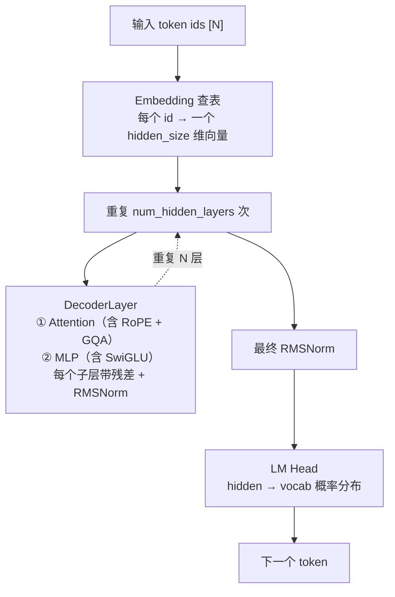
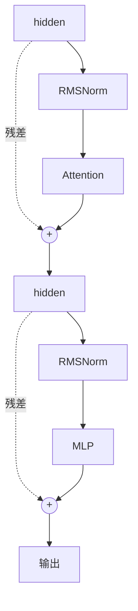
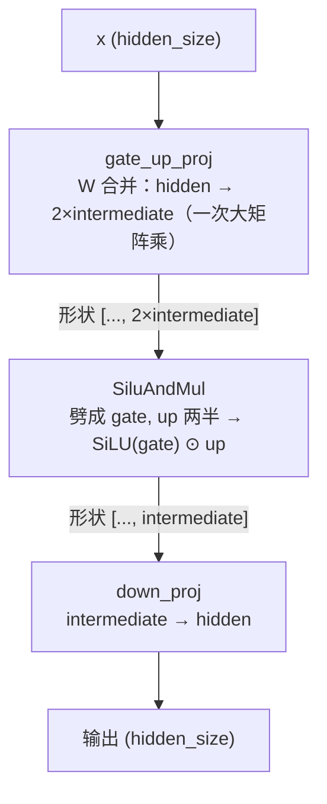
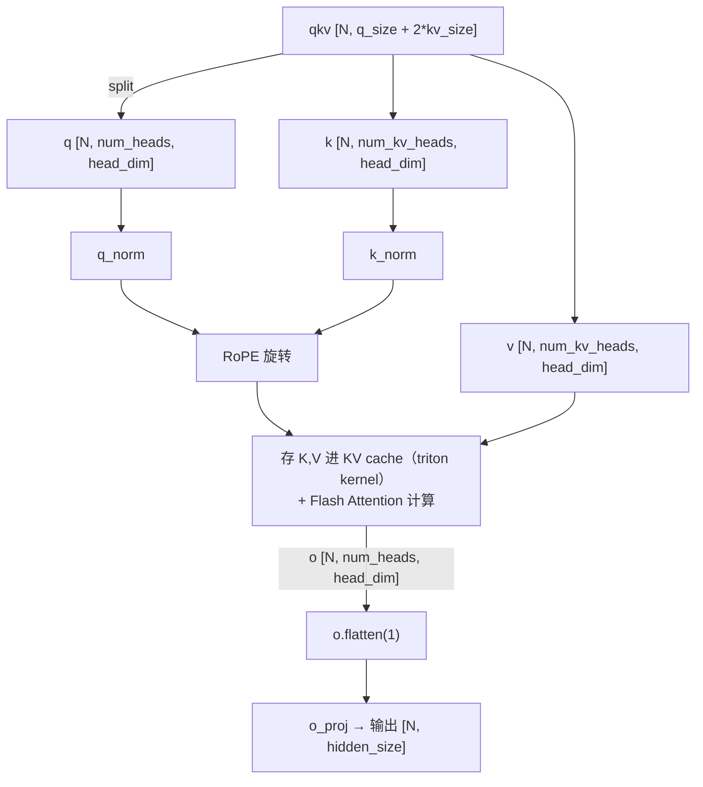

# 第 2 部分（1/3）· 模型本体理论：从 RoPE 到 Attention 的数学

> 🎯 **本篇目标**：把 nano-vllm 里 **Qwen3 模型本体**涉及的每一项技术，从数学原理讲到代码实现。读完你应能回答：
> - RoPE 旋转位置编码为什么能编码"相对位置"？怎么用复数一行推导出来？
> - RMSNorm 比 LayerNorm 省在哪？为什么计算时要先转 float？
> - SwiGLU 是什么，为什么现代模型都用它？
> - GQA（分组查询注意力）是怎么省 KV cache 的？Qwen3 的 q_norm/k_norm 又是干嘛的？
>
> 本篇和第 1 部分不重复：第 1 部分讲"引擎怎么调度"，本篇讲"模型本体怎么算"。对应代码在 [`models/qwen3.py`](../nanovllm/models/qwen3.py) 和 [`layers/`](../nanovllm/layers/)。

---

## 0. 先看 Qwen3 长什么样

在讲细节前，先给一张 Qwen3 的"解剖图"。nano-vllm 里整个模型就是按这个结构搭的（见 [`models/qwen3.py`](../nanovllm/models/qwen3.py)）：



> 🫀 **这张图怎么读**：这是 Qwen3 模型的"解剖图"，从上到下是**一个 token 变成预测结果的完整流水线**；虚线箭头 `-.->` 表示"这一段重复 N 次"。
>
> - **输入 token ids**：一串整数编号，每个词对应一个 id。
> - **Embedding 查表**：把每个 id 换成一个几百维的向量（hidden_size 维），相当于"给每个词发一张身份向量卡"。
> - **DecoderLayer × N**：模型的主力，重复很多层（Qwen3-0.6B 是 28 层）。每一层都在精炼这些向量，让它们承载越来越多的上下文语义；每层内含 Attention（看上下文）和 MLP（做变换）。
> - **最终 RMSNorm**：出场前做一次归一化，把数值范围理顺。
> - **LM Head**：把最后一层的向量映射成"词表上每个词的概率分布"。
> - **下一个 token**：从概率分布里采样（或取最大）得到预测的下一个词。
>
> 💡 整个模型**只负责"预测下一个 token"**；生成一整句话，就是把这个流水线循环很多次（配合上一篇的生命周期图）。

一个 DecoderLayer 内部（[`Qwen3DecoderLayer`](../nanovllm/models/qwen3.py)）：



> 🔧 **这张图怎么读**：这是**一个 DecoderLayer 内部**的结构。横向是数据流，`-.->` 虚线是"残差连接"（绕过子层把原始输入直接送过去），圆圈 `( + )` 是"逐元素相加"。
>
> 一层里有两个**结构对称**的子块，各做一件事：
> - **第一块（Attention）**：`hidden → RMSNorm → Attention → ＋ 残差`，让每个位置"看到"其他位置的信息。
> - **第二块（MLP）**：`hidden → RMSNorm → MLP → ＋ 残差`，对每个位置独立做非线性变换（"消化吸收"）。
>
> 🤔 **为什么要有残差（那条绕路虚线）？** 没有它，信息要层层穿过变换，容易在深层网络里失真、消失（梯度消失）。加了残差，相当于每层在原输入基础上"加一点修正"（`输出 = 输入 + 该层贡献`），即使某层没学到东西，信息也能原封不动传下去——这正是几十层深网络能训得动的关键。
>
> 🤔 **为什么先 RMSNorm 再进子层？** 这叫 **Pre-Norm**：先归一化让数值稳定，再做 Attention/MLP，训练更稳，是现代 Transformer（含 Qwen3）的标准做法。

下面我们逐个拆这些积木。

---

## 1. RoPE 旋转位置编码 ⭐（本篇最硬核）

对应代码：[`layers/rotary_embedding.py`](../nanovllm/layers/rotary_embedding.py)

### 1.1 为什么需要位置编码？

先记住一个反直觉但关键的事实：**Attention 天生是"不分前后"的**。

Attention 的核心运算是 $\text{softmax}(QK^\top/\sqrt{d})V$——它只看 Q 和 K 向量之间的相似度，**根本不关心这些向量来自第几个位置**。如果你把一句话的 token 顺序打乱，只要 Q/K/V 跟着打乱，Attention 的输出也只是相应打乱而已。

这对语言是灾难。"狗咬人"和"人咬狗"token 相同、顺序不同，意思天差地别。所以必须额外把**位置信息**注入模型。

### 1.2 绝对 vs 相对位置

| 方案 | 思路 | 代表 |
|---|---|---|
| **绝对位置编码** | 给第 m 个位置一个固定向量 $p_m$，加到 token 上：$x_m + p_m$ | 原版 Transformer |
| **相对位置编码** | 让 attention 分数 $\langle q_m, k_n\rangle$ 直接依赖**距离** $m-n$ | T5 relative bias、RoPE |

直觉：语言里**相对位置**往往比绝对位置重要。"我爱你"和"昨天我爱你"里，"我-爱"的关系没变（都是相邻），只是绝对位置变了。一个好的位置编码应该让"相邻 token 的关系"对绝对位置不敏感。

> 🎯 **RoPE 的目标**：找一个位置变换 $R$，作用在每个位置的 q、k 上，使得 attention 分数只依赖两个位置的**差**：
>
> $$
> \langle R_m\, q,\; R_n\, k \rangle \;\text{只依赖}\; (m - n)
> $$
>
> 其中 $R_m$ 表示"位置 $m$ 对应的变换"。这叫**"用绝对位置的变换，实现相对位置的内积"**。

### 1.3 从复数乘法开始（2D 情形）

为了推导好懂，先假设 head_dim = 2（一个注意力头只有 2 维）。把 query 的这两个分量 $(q_0, q_1)$ 看成一个**复数**：

$$
\tilde{q} = q_0 + i\, q_1
$$

复数的一个神奇性质：**乘以单位复数 $e^{i\theta} = \cos\theta + i\sin\theta$，等于在复平面上旋转 $\theta$ 角度**。算一下：

$$
\tilde{q} \cdot e^{i\theta} = (q_0\cos\theta - q_1\sin\theta) + i\,(q_0\sin\theta + q_1\cos\theta)
$$

写成矩阵形式，这正是**旋转矩阵**：

$$
R(\theta) = \begin{pmatrix} \cos\theta & -\sin\theta \\ \sin\theta & \cos\theta \end{pmatrix}, \quad R(\theta)\begin{pmatrix}q_0\\q_1\end{pmatrix} = \begin{pmatrix} q_0\cos\theta - q_1\sin\theta \\ q_0\sin\theta + q_1\cos\theta \end{pmatrix}
$$

### 1.4 关键一步：证明它实现了相对位置

现在，把**位置 $m$** 的 query 旋转 $m\theta$，**位置 $n$** 的 key 旋转 $n\theta$：

$$
\tilde{q}_m = \tilde{q}\cdot e^{im\theta}, \qquad \tilde{k}_n = \tilde{k}\cdot e^{in\theta}
$$

attention 分数是它们的内积。复数内积用**实部**计算：

$$
\langle \tilde{q}_m,\, \tilde{k}_n \rangle = \text{Re}\!\left(\tilde{q}_m \cdot \overline{\tilde{k}_n}\right)
$$

（$\overline{\cdot}$ 是复共轭）。代入：

$$
= \text{Re}\!\left(\tilde{q}\cdot e^{im\theta} \cdot \overline{\tilde{k}\cdot e^{in\theta}}\right)
= \text{Re}\!\left(\tilde{q}\cdot \overline{\tilde{k}} \cdot e^{im\theta}\cdot e^{-in\theta}\right)
= \text{Re}\!\left(\tilde{q}\cdot \overline{\tilde{k}} \cdot e^{i(m-n)\theta}\right)
$$

> 🏆 **见证奇迹**：最终表达式里位置 $m, n$ 只以 $(m-n)$ 的形式出现！无论绝对位置多大，只要两个 token 的**相对距离**一样，attention 分数就一样。目标达成。

### 1.5 推广到高维（真实的 head_dim = 128）

真实的头有 $d$ 维（Qwen3 是 128）。把 $d$ 个维度**两两一组**，分成 $d/2$ 个 2D 子空间，每个子空间用**不同频率** $\theta_j$ 独立旋转：

$$
\theta_j = \text{base}^{-2j/d}, \quad j = 0, 1, \dots, d/2 - 1
$$

（Qwen3 的 `base = 1000000`，见 [`qwen3.py`](../nanovllm/models/qwen3.py) 里的 `rope_theta`。）

为什么用多个频率？这是**多尺度**思想：

- 频率高（$\theta$ 大）→ 旋转得快 → 对短距离敏感（但长距离上转得太快会"绕晕"，分辨不出）
- 频率低（$\theta$ 小）→ 旋转得慢 → 能覆盖长距离

```
位置轴 m →   0    1    2    3    4    5   ...
高频 θ大:   0°  120° 240° 360° 120° ...  ← 短期细节，长距离重复
低频 θ小:   0°   5°  10°  15°  20°  ...  ← 长期趋势，平滑单调

多频率叠加 = 既看清近处细节，又能区分远处位置（类比傅里叶基 / 时钟的秒针+分针+时针）
```

> 🔬 **和傅里叶变换的深刻联系**：RoPE 本质上是对 query/key 做了一次"位置调制的复指数变换"，$\theta_j$ 就是频率分量。这也是为什么 RoPE 对长度泛化有不错的表现——它有一组覆盖不同尺度的频率基。

### 1.6 高效实现：不构造稀疏矩阵

数学上，完整旋转矩阵是个很大的分块对角稀疏矩阵（$d\times d$，但只有 $2\times 2$ 块在对角）。但直接乘它很浪费。利用复数乘法 $(x_1 + i x_2)(\cos\theta + i\sin\theta) = (x_1\cos\theta - x_2\sin\theta) + i(x_2\cos\theta + x_1\sin\theta)$，可以用**逐元素运算**完成：

把 $x$ 沿最后一维劈成前后两半 $x_1, x_2$（各 $d/2$ 维），然后：

$$
y_1 = x_1 \odot \cos\theta - x_2 \odot \sin\theta
$$
$$
y_2 = x_2 \odot \cos\theta + x_1 \odot \sin\theta
$$
$$
y = [y_1;\, y_2] \quad\text{(拼回去)}
$$

（$\odot$ 是逐元素乘，$\cos\theta, \sin\theta$ 都是 $d/2$ 维向量。）这正是 nano-vllm 里 [`apply_rotary_emb`](../nanovllm/layers/rotary_embedding.py) 干的事：

```python
def apply_rotary_emb(x, cos, sin):
    x1, x2 = torch.chunk(x.float(), 2, dim=-1)   # 劈成前后两半
    y1 = x1 * cos - x2 * sin
    y2 = x2 * cos + x1 * sin
    return torch.cat((y1, y2), dim=-1).to(x.dtype)
```

### 1.7 cos/sin 表的预计算

每步要给每个位置 $m$ 查 $\cos(m\theta_j), \sin(m\theta_j)$。nano-vllm 预计算一张表存起来（[`RotaryEmbedding.__init__`](../nanovllm/layers/rotary_embedding.py)）：

```python
inv_freq = 1.0 / (base ** (torch.arange(0, rotary_dim, 2) / rotary_dim))  # θ_j = base^{-2j/d}
t = torch.arange(max_position_embeddings)                                   # 位置 m
freqs = torch.einsum("i,j -> ij", t, inv_freq)                             # freqs[m,j] = m·θ_j
cos, sin = freqs.cos(), freqs.sin()
cache = torch.cat((cos, sin), dim=-1)   # [max_pos, d]
```

> 💡 `einsum("i,j->ij", t, inv_freq)` 是**外积**：`freqs[m,j] = m × θ_j`。这就是把每个位置 $m$ 乘上每个频率 $\theta_j$，得到位置-频率矩阵。
>
> 注意这里有个巧妙的**单例缓存**：[`@lru_cache(1)`](../nanovllm/layers/rotary_embedding.py) 让 `get_rope` 对同一组参数只构造一次 `RotaryEmbedding`，所有层共用同一张 cos/sin 表（因为每层的 RoPE 参数完全一样）。这是 Python 装饰器在工程里的实用案例，第 3 部分会讲。

### 1.8 RoPE 小结

```
RoPE 的本质 = "用绝对位置的旋转，实现相对位置的内积"
         = 对每个 2D 子空间，按位置 m 旋转 m·θ_j
         = 多个频率 θ_j 覆盖不同距离尺度
```

- ✅ 编码相对位置（语言友好）
- ✅ 远距离可外推（多频率）
- ✅ 实现高效（只需逐元素乘加 + 预计算 cos/sin 表）
- ✅ 天然适配 KV cache：每个位置的 K 只算一次存下来，旋转角度由位置决定

---

## 2. RMSNorm：比 LayerNorm 更省

对应代码：[`layers/layernorm.py`](../nanovllm/layers/layernorm.py)

### 2.1 先回忆 LayerNorm

原版 LayerNorm 对一个向量 $x \in \mathbb{R}^d$ 做三步：

$$
\mu = \frac{1}{d}\sum_i x_i \quad\text{(均值)}
$$
$$
\sigma^2 = \frac{1}{d}\sum_i (x_i - \mu)^2 \quad\text{(方差)}
$$
$$
\text{LayerNorm}(x) = \gamma \odot \frac{x - \mu}{\sqrt{\sigma^2 + \epsilon}} + \beta
$$

（$\gamma, \beta$ 是可学习参数，$\epsilon$ 防止除零。）

### 2.2 RMSNorm 的简化

RMSNorm（Root Mean Square Normalization）观察到一个经验事实：**减均值那一步对效果影响不大，但占了不少计算**。于是它**只做缩放归一化，不减均值**：

$$
\text{RMS}(x) = \sqrt{\frac{1}{d}\sum_i x_i^2 + \epsilon}
$$
$$
\boxed{\;\text{RMSNorm}(x) = \gamma \odot \frac{x}{\text{RMS}(x)}\;}
$$

对比：

| | LayerNorm | RMSNorm |
|---|---|---|
| 减均值 | ✅ 要 | ❌ 不要 |
| 算方差 $\sigma^2$ | ✅ 要（要均值） | ❌ 用 RMS² 代替 |
| 可学习参数 | $\gamma, \beta$ | 只有 $\gamma$ |
| 计算量 | 略大 | **省约 7%~64%**（看实现） |
| 效果 | 基准 | 基本持平，有时更好 |

现代大模型（LLaMA、Qwen 系列）几乎全用 RMSNorm。

### 2.3 代码里的两个细节

**(1) 数值稳定性——先转 float32 再算**（[`rms_forward`](../nanovllm/layers/layernorm.py)）：

```python
orig_dtype = x.dtype        # 记住原精度（bf16）
x = x.float()               # 升到 float32 算归一化
var = x.pow(2).mean(dim=-1, keepdim=True)
x.mul_(torch.rsqrt(var + self.eps))
x = x.to(orig_dtype).mul_(self.weight)   # 算完再降回 bf16
```

为什么？bf16（半精度）的表示范围和精度都有限，算"平方、求和、开方"这种容易溢出/丢精度的运算时，中间结果用 float32 才稳定。这是**混合精度训练/推理**的标准技巧。

> 🔬 用 `rsqrt`（reciprocal square root，倒数开方）而不是 `1/sqrt`：因为 GPU 有专用的快速倒数开方指令，比"先开方再取倒数"更快。

**(2) 融合残差——`add_rms_forward`**：

注意 Qwen3 的 DecoderLayer 是"残差 + 归一化"连着的（见 0 节的图）。nano-vllm 把"加残差"和"RMSNorm"**融合**进同一个函数（[`add_rms_forward`](../nanovllm/layers/layernorm.py)）：

```python
x = x.float().add_(residual.float())   # 先加残差（在 float32 下）
residual = x.to(orig_dtype)            # 加完的值存为新的 residual
var = x.pow(2).mean(...)               # 再对加完的结果归一化
...
```

好处：residual 只读一次、写一次，省一次显存往返。在访存密集的 decode 阶段（见第 1 部分 §3），这种"融合"对提速很关键。

### 2.4 `@torch.compile` 自动融合

[`RMSNorm`](../nanovllm/layers/layernorm.py) 的两个 forward 都标了 `@torch.compile`。这意味着 PyTorch 会把上面那些零碎运算（平方、求均值、开方、乘权重）**编译融合成一个或少 数个 GPU kernel**，进一步减少 kernel 启动开销和中间显存读写。第 2c 部分会专门讲 torch.compile。

---

## 3. SwiGLU 激活：门控的 SiLU

对应代码：[`layers/activation.py`](../nanovllm/layers/activation.py) 和 [`Qwen3MLP`](../nanovllm/models/qwen3.py)

### 3.1 MLP 的进化：从 ReLU 到 GLU 再到 SwiGLU

Transformer 的 MLP 子层负责"非线性变换"。历代激活函数：

```
ReLU(x)    = max(0, x)                    # 最朴素，但有"死神经元"
GELU(x)    = x · Φ(x)                     # BERT/GPT 用的平滑版
GLU(x,W)   = (xW) ⊙ σ(xW_gate)            # 门控线性单元：一半做信息，一半做"门"
SiLU(x)    = x · sigmoid(x)               # 又叫 swish，平滑的 ReLU
SwiGLU     = (xW_up) ⊙ SiLU(xW_gate)      # 用 SiLU 当门的 GLU  ← 现代标配
```

（$\odot$ 逐元素乘，$\sigma$ 是 sigmoid。）

### 3.2 SwiGLU 公式

$$
\boxed{\;\text{SwiGLU}(x) = \underbrace{(x W_{\text{up}})}_{\text{信息}} \;\odot\; \underbrace{\text{SiLU}(x W_{\text{gate}})}_{\text{门控}}\;}
$$

其中 $\text{SiLU}(x) = x \cdot \sigma(x) = x \cdot \frac{1}{1+e^{-x}}$。

**直觉**：把输入同时投影成两路——一路当"信息内容"，一路当"开关门"。门控决定每个维度让多少信息通过。相比单一激活，多了一个**可学习的、逐维度的动态调控**，表达力更强。实验上 SwiGLU 几乎全面优于 ReLU/GELU，所以 LLaMA、Qwen 全家都用它。

### 3.3 代码实现：一个"合并矩阵"

注意公式里 $W_{\text{up}}$ 和 $W_{\text{gate}}$ 是两个独立的权重矩阵，但它们都接收**同一个 $x$**。所以工程上把两个矩阵**合并成一个胖矩阵 $W_{[\text{gate; up}]}$**，做**一次**矩阵乘，再劈成两半：

```python
class SiluAndMul(nn.Module):
    @torch.compile
    def forward(self, x):
        x, y = x.chunk(2, -1)      # 胖矩阵结果劈成 gate 和 up 两半
        return F.silu(x) * y        # SiLU(gate) ⊙ up
```

对应 [`Qwen3MLP`](../nanovllm/models/qwen3.py)：

```python
gate_up = self.gate_up_proj(x)   # 一次矩阵乘，输出是 [gate ; up] 拼接
x = self.act_fn(gate_up)         # SiluAndMul：劈开、SiLU(gate)*up
x = self.down_proj(x)            # 再投影回 hidden_size
```

> 💡 **为什么要合并矩阵**：GPU 上"一次大矩阵乘" 比 "两次小矩阵乘" 高效得多——减少了一次 kernel 启动、更好利用 Tensor Core、访存更连续。这是典型的 **kernel 融合** 思想。这也解释了为什么 nano-vllm 的权重加载（[`loader.py`](../nanovllm/utils/loader.py)）要把 `gate_proj` 和 `up_proj` 拼成 `gate_up_proj`（见 [`Qwen3ForCausalLM.packed_modules_mapping`](../nanovllm/models/qwen3.py)）——HuggingFace 存的是分开的，nano-vllm 加载时拼起来。

### 3.4 完整 MLP 流程图



> 🧪 **这张图怎么读**：这是**一个 MLP 子层**的内部流水线，三步走：升维 → 激活筛选 → 降维。箭头上的"形状"标注了每步张量的维度变化。
>
> - **`gate_up_proj`（升维）**：把 hidden 维向量一次乘成 `2×intermediate` 维。这里有个工程技巧——把本该分开的 gate（门控）和 up（升维）两个矩阵**合并成一个大矩阵**一次算完，省一次 kernel 启动。
> - **`SiluAndMul`（激活）**：把 `2×intermediate` 劈成 gate、up 两半，再算 `SiLU(gate) ⊙ up`。其中 `SiLU(gate)` 可看成"每个维度的重要性分数"，`⊙ up` 则用这个分数**逐维度门控**——重要的维度放行、不重要的压低。这就是 **SwiGLU** 的核心：**让网络自己决定哪些信息该通过**。
> - **`down_proj`（降维）**：把 intermediate 维压回 hidden 维，交给下一层。
>
> 🍳 **类比**：像信息过筛子——先把信息摊开（升维），用一把"智能筛子"挑出有用的部分（SwiGLU 门控），再压缩回去（降维）。

---

## 4. Attention 全貌：GQA 与 Qwen3 的 q/k_norm

对应代码：[`Qwen3Attention`](../nanovllm/models/qwen3.py) + [`layers/attention.py`](../nanovllm/layers/attention.py)

### 4.1 标准 Multi-Head Attention 回顾

给定 hidden 向量，先投影出 Q、K、V，分成多个头，每个头独立做 attention：

$$
Q = x W_Q,\quad K = x W_K,\quad V = x W_V
$$
$$
\text{head}_i = \text{Attention}(Q_i, K_i, V_i) = \text{softmax}\!\left(\frac{Q_i K_i^\top}{\sqrt{d}}\right)V_i
$$
$$
\text{MHA}(x) = \text{Concat}(\text{head}_1, \dots, \text{head}_h)\, W_O
$$

关键：MHA 里 **Q 的头数 = K/V 的头数 = h**。

### 4.2 MHA / MQA / GQA：KV 头数的故事

K 和 V 是要被**存进 KV cache** 的（第 1 部分 §4 算过，KV cache 极占显存）。于是人们想办法**减少 KV 的头数**：

```
MHA (Multi-Head Attention)        num_kv_heads = num_heads
  Q: 头1 头2 头3 头4 头5 头6 头7 头8
  K: 头1 头2 头3 头4 头5 头6 头7 头8   ← 每个Q头有自己的KV，KV cache最大
  V: 头1 头2 头3 头4 头5 头6 头7 头8

MQA (Multi-Query Attention)       num_kv_heads = 1
  Q: 头1 头2 头3 头4 头5 头6 头7 头8
  K: ──────────── 头1 ────────────   ← 所有Q头共享1组KV，KV cache最小，但质量掉
  V: ──────────── 头1 ────────────

GQA (Grouped-Query Attention)     1 < num_kv_heads < num_heads   ← 折中！
  Q: 头1 头2 头3 头4 头5 头6 头7 头8
  K: ── 头1 ── ── 头2 ──              ← 每 num_heads/num_kv_heads 个Q头共享一组KV
  V: ── 头1 ── ── 头2 ──              （Qwen3-0.6B: 16个Q头共享8组KV）
```

| 方案 | num_kv_heads | KV cache 大小 | 质量 | 用途 |
|---|---|---|---|---|
| MHA | = num_heads | 最大 | 最好 | 训练 / 小模型 |
| MQA | = 1 | 最小（1/h） | 掉一些 | 极致省显存 |
| **GQA** | 中间值 | 中等（num_kv_heads/h） | 接近 MHA | **现代推理标配** |

> 💡 Qwen3-0.6B：`num_attention_heads=16`，`num_key_value_heads=8`，所以是 **GQA**：每 2 个 Q 头共享 1 组 KV。这直接把 KV cache 砍掉一半（对应第 1 部分 §4.3 公式里的 $n_{\text{kv\_head}}=8$ 而不是 16）。

### 4.3 GQA 在代码里怎么实现

[`Qwen3Attention.__init__`](../nanovllm/models/qwen3.py)：

```python
self.total_num_heads = num_heads              # Q 头数（16）
self.num_heads = self.total_num_heads // tp   # 本卡分到的 Q 头
self.total_num_kv_heads = num_kv_heads        # KV 头数（8）
self.num_kv_heads = self.total_num_kv_heads // tp
self.q_size = self.num_heads * self.head_dim       # Q 的维度
self.kv_size = self.num_kv_heads * self.head_dim   # K/V 的维度（比 q 小！）
```

attention 时，每个 Q 头去"复用"对应的 KV 头（flash attention 内部处理这个复用，叫 broadcast）。这就是 GQA 省显存的本质——**KV 的头数少了，要存的 K/V 就少了**。

### 4.4 scaling 为什么是 1/√d

第 1 部分 §3.1 提到 attention 里有个 $\sqrt{d}$ 缩放。为什么？

Q 和 K 的内积 $q\cdot k = \sum_{i=1}^d q_i k_i$。如果 $q_i, k_i$ 是独立同分布、均值 0、方差 1 的随机变量，那么内积的方差 $\propto d$（$d$ 个乘积项相加）。也就是说**头维度 $d$ 越大，内积数值越大**。

而 softmax 对数值大小很敏感：数值太大 → 指数爆炸 → 梯度几乎全集中在一个位置（饱和）。除以 $\sqrt{d}$ 把方差拉回 $\propto 1$，让 softmax 工作在健康的数值区间。

$$
\text{score}_{mn} = \frac{q_m \cdot k_n}{\sqrt{d}}
$$

代码里 `self.scaling = self.head_dim ** -0.5`（即 $1/\sqrt{d}$），传给 flash attention 的 `softmax_scale`。

### 4.5 Qwen3 特色：q_norm / k_norm

看 [`Qwen3Attention`](../nanovllm/models/qwen3.py) 会发现一个 Qwen3 独有的细节：对 Q 和 K 各做一次 RMSNorm：

```python
if not self.qkv_bias:
    self.q_norm = RMSNorm(self.head_dim, eps=rms_norm_eps)
    self.k_norm = RMSNorm(self.head_dim, eps=rms_norm_eps)
...
q, k, v = qkv.split([self.q_size, self.kv_size, self.kv_size], dim=-1)
q = q.view(-1, self.num_heads, self.head_dim)
k = k.view(-1, self.num_kv_heads, self.head_dim)
if not self.qkv_bias:
    q = self.q_norm(q)    # ← Qwen3 独有：对 Q 做 RMSNorm
    k = self.k_norm(k)    # ← 对 K 也做（注意 K 是被存进 cache 的！）
q, k = self.rotary_emb(positions, q, k)   # 再做 RoPE
```

**为什么 Qwen3 要加这个？**

- 小模型（0.6B/1.7B）容量小，训练时 Q/K 的数值分布容易不稳定，影响 attention 质量。
- 对 Q/K 做归一化，把它们的尺度拉回稳定区间，**提升小模型的训练稳定性和最终效果**。这是 Qwen3 相对 Qwen2 的改进点之一。
- ⚠️ 注意 K 被归一化了——而 K 是要**存进 KV cache** 的。这意味着存进 cache 的是**归一化后的 K**，decode 时直接用，不需要重新归一化。这个细节第 2b 部分讲 KV cache 存储时会呼应。
- ⚠️ 为什么套在 `if not self.qkv_bias:` 里？这里的 `qkv_bias` 其实来自构造时的 `getattr(config, 'attention_bias', True)`（见 [`qwen3.py`](../nanovllm/models/qwen3.py)）。Qwen3-0.6B 的 `config.json` 里 `attention_bias=false`，所以 `qkv_bias=False`、条件成立、q_norm/k_norm **会启用**。这是 Qwen3 的一种耦合设计：**不带 attention bias 的变体**才补这层归一化来稳数值；如果你换成一个 `attention_bias=true` 的模型，这段 norm 会被整个跳过——改代码做实验时别被这个 `if` 坑到。

### 4.6 一个 Attention 层的完整数据流

把本节和 RoPE 串起来，一个 Qwen3 Attention 层做的事：



> 🎯 **这张图怎么读**：这是**一个 Attention 层从头到尾做的事**，从上到下是数据流；分叉表示"一份拆成几路"，汇合表示"几路合到一起"。
>
> - **qkv 投影 + split**：把 hidden 向量一次投影后切出 **Q、K、V** 三份。
> - **GQA（分组查询注意力）**：注意 Q 的头数（`num_heads`）比 K/V 的头数（`num_kv_heads`）多——多个 Q 头**共享**同一组 KV。Qwen3-0.6B 是 16 个 Q 头共享 8 组 KV，直接把 KV cache 砍半，省显存而几乎不掉精度。
> - **q_norm / k_norm**：对 Q、K 各做一次归一化（Qwen3 特有），稳定训练。
> - **RoPE 旋转**：给 Q、K 注入"位置信息"——旋转角度随位置变化，让模型知道"谁在前、谁在后"。
> - **存 KV 进 cache + Flash Attention**：把新的 K、V 按 slot 写进 KV cache，再用 Flash Attention 高效算出注意力输出 `o`。
> - **o_proj**：把多头输出拼平后做一次线性投影，得到这一层的最终输出。
>
> 💡 一句话总结：**投影出 Q/K/V → 加位置（RoPE）→ 存历史（KV cache）→ 算注意力（Flash Attention）→ 投影回去**。

---

## 本篇小结

你现在掌握了 Qwen3 模型本体的全部数学原理：

1. **RoPE**：用复数旋转 $e^{im\theta}$ 编码位置，巧妙地让 attention 分数只依赖相对位置 $(m-n)$；多频率覆盖不同距离尺度；实现上用前后半劈分 + 逐元素乘加等价复数乘法。
2. **RMSNorm**：省掉 LayerNorm 的减均值，只做 RMS 归一化，更省算力；混合精度下先转 float32 保证数值稳定；融合残差减少访存。
3. **SwiGLU**：门控激活 $(xW_{\text{up}})\odot\text{SiLU}(xW_{\text{gate}})$；工程上把两个权重矩阵合并成胖矩阵一次算（kernel 融合）。
4. **GQA**：减少 KV 头数省 KV cache（Qwen3-0.6B 用 8 组 KV 服务 16 个 Q 头）；scaling $1/\sqrt{d}$ 防 softmax 饱和；Qwen3 独有的 q_norm/k_norm 稳定小模型训练。

### 📍 第 2 部分进度

```
[2a 模型本体理论] ✅你在这里 ➜ [2b 引擎核心机制] ➜ [2c 加速并行与采样]
```

> **下一篇预告（2b）**：把镜头从"模型本体"切到"引擎机制"——KV cache 在代码里到底长什么形状？PagedAttention 的 block/slot/block_table/引用计数如何协作？Prefix Caching 的"链式哈希"是怎么让相同前缀自动命中的？调度器如何同时实现 Continuous Batching + Chunked Prefill + Preemption？

---

> 📌 本篇的数学密度（复数推导 + 公式 + 代码对应）就是 2b/2c 的基准。继续吗？
