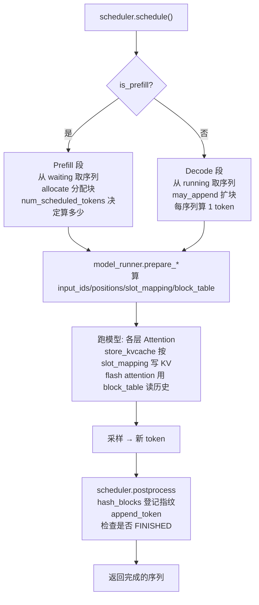

# 第 2 部分（2/3）· 引擎核心机制：KV Cache、PagedAttention 与调度

> 🎯 **本篇目标**：把引擎层最核心的几样东西，从"数据结构 + 算法"层面讲透。读完你应能回答：
> - KV cache 在显存里到底长什么形状？一个 token 的 K/V 怎么找到自己的"格子"？
> - PagedAttention 的 block / block_table / slot 三件套如何协作？
> - Prefix Caching 凭一个"链式哈希"就能让相同前缀自动命中，原理是什么？
> - 调度器怎么在一个 `schedule()` 里同时实现 Continuous Batching + Chunked Prefill + Preemption？
>
> 对应代码：[`engine/block_manager.py`](../nanovllm/engine/block_manager.py)、[`engine/scheduler.py`](../nanovllm/engine/scheduler.py)、[`engine/sequence.py`](../nanovllm/engine/sequence.py)。
>
> 本篇和第 1 部分的关系：第 1 部分讲"为什么需要这些机制"（直觉），本篇讲"它们在代码里是怎么实现的"（数据结构与算法）。

---

## 1. KV Cache 的"物理形态"：它在显存里长什么样

第 1 部分我们用公式算过 KV cache 有多大，但没说它**怎么摆放**。现在来看它的物理结构。

### 1.1 一个大张量装下所有层的 KV cache

nano-vllm 不是给每层、每头单独分配一堆小张量，而是**一次性分配一个大张量**，把所有层的 KV cache 全装进去（[`allocate_kv_cache`](../nanovllm/engine/model_runner.py)）：

```python
self.kv_cache = torch.empty(
    2,                  # 0 是 K，1 是 V
    num_hidden_layers,  # 层数
    num_kvcache_blocks, # 块数（由剩余显存决定）
    block_size,         # 每块 256 个 token
    num_kv_heads,       # KV 头数（GQA 后的）
    head_dim            # 每头维度
)
```

画成图：

kv_cache  形状 = [2, L层, B块, 256, H头, D维]

   索引0 → K                     索引1 → V
   ┌─────── K (索引0) ────────┐  ┌─────── V (索引1) ────────┐
   │  层0  层1  层2 ... 层L-1 │  │  层0  层1  层2 ... 层L-1 │
   │ ┌───┐┌───┐┌───┐   ┌───┐  │  │ ┌───┐┌───┐┌───┐   ┌───┐  │
   │ │░░░││░░░││░░░│...│░░░│  │  │ │░░░││░░░││░░░│...│░░░│  │
   │ └───┘└───┘└───┘   └───┘  │  │ └───┘└───┘└───┘   └───┘  │
   │ blk0 blk1 blk2   blkB-1  │  │ blk0 blk1 blk2   blkB-1  │
   └──────────────────────────┘  └──────────────────────────┘

             每个块内部:  [256 token, H头, D维]

> 💡 **为什么用一个大张量而不是很多小张量？** ① 连续分配、一次性，碎片少；② 各层可以通过 `module.k_cache = self.kv_cache[0, layer_id]` 用**视图（view）**直接引用同一块显存，零拷贝；③ 释放/复用只需改 block_table 指针，不搬运数据。

### 1.2 每层的 Attention 怎么"挂"到这个大张量上

[`allocate_kv_cache`](../nanovllm/engine/model_runner.py) 末尾有这段：

```python
layer_id = 0
for module in self.model.modules():
    if hasattr(module, "k_cache") and hasattr(module, "v_cache"):
        module.k_cache = self.kv_cache[0, layer_id]   # 第 layer_id 层的 K 切片
        module.v_cache = self.kv_cache[1, layer_id]   # 第 layer_id 层的 V 切片
        layer_id += 1
```

每层的 `Attention` 模块都拿到**自己那一层的 K/V 切片**（形状 `[B块, 256, H头, D维]`）。之后 attention 计算时，新 token 的 K/V 就写到这个切片里，读取历史也从这个切片读。

### 1.3 slot：块内的具体格子

KV cache 被切成 `B` 个 block，每个 block 装 256 个 token。一个 block 内的位置叫 **slot**。

某个层的 K 切片: [B块, 256, H头, D维]

  block 0                  block 1                block 2  ...
  ┌────┬────┬────┬────┬────┐   ┌────┬────┬────┬────┬────┐   ┌────┬────┐
  │ s0 │ s1 │ s2 │... │s255│   │ s0 │ s1 │ s2 │... │s255│   │ s0 │ s1 │...
  │tok │tok │tok │    │tok │   │tok │tok │tok │    │tok │   │tok │tok │
  └────┴────┴────┴────┴────┘   └────┴────┴────┴────┴────┘   └────┴────┘

  "全局 slot 编号" = block_id × 256 + 块内偏移
  例: block 1 的 slot 3 → 全局 = 1×256 + 3 = 259

> 🔑 **slot_mapping 的本质**：告诉每个新算出来的 token，"你的 K/V 应该写到全局 slot 几"。这个映射在每次前向前由 `prepare_prefill`/`prepare_decode` 算好（第 4 部分逐行讲），attention 层用一个 triton kernel 据此把 K/V 写进 cache（第 2c 部分讲）。

### 1.4 呼应 2a：存进 cache 的是"归一化后的 K"

还记得 2a §4.5 Qwen3 对 K 做了 `k_norm` 吗？注意执行顺序：

```
k = qkv_proj(...) → k_norm(k) → rotary_emb(k) → 存进 k_cache
```

所以 **KV cache 里存的是"归一化 + RoPE 旋转之后"的 K**。这是对的——decode 时直接拿来用，不用重新归一化/旋转。这也意味着 cache 里的 K 已经是"最终形态"，attention 读出来就能直接算。设计上很自洽。

---

## 2. PagedAttention 的数据结构三件套

第 1 部分用"虚拟内存"类比讲了 PagedAttention 的思想。现在看它的**数据结构实现**。

### 2.1 Block：一个物理块

[`Block`](../nanovllm/engine/block_manager.py) 是物理块的抽象，4 个字段：

```python
class Block:
    def __init__(self, block_id):
        self.block_id   = block_id     # 这个块的编号（0 ~ B-1）
        self.ref_count  = 0            # 有几个序列在用它（引用计数，前缀共享用）
        self.hash       = -1           # 这个块内容的"指纹"（prefix caching 用，-1 表示未算）
        self.token_ids  = []           # 这个块里装的 token（用于算/校验 hash）
```

- `ref_count`：引用计数。多个序列共享同一前缀块时，每多一个序列引用就 +1；都释放了才真回收（见 §4）。
- `hash` + `token_ids`：专门为 Prefix Caching 服务（见 §4）。

### 2.2 block_table：序列的"页表"

每个 `Sequence` 有一个 `block_table`（[`Sequence`](../nanovllm/engine/sequence.py) 的 `self.block_table = []`），它就是这个序列的"页表"——记录"我的第 i 个逻辑块，对应物理块编号几"。

### 2.3 三件套协作：一个具体例子

假设 `block_size = 4`（为画图方便，实际是 256），有一个序列有 9 个 token：

```
序列 X 的 token:  [t0 t1 t2 t3 | t4 t5 t6 t7 | t8]
                   ──逻辑块0──   ──逻辑块1──    块2(半满)

序列 X 的 block_table = [5, 2, 7]   ← 我的逻辑块0→物理块5, 块1→物理块2, 块2→物理块7

物理显存（块的池子）:
  block_id:  0    1    2    3    4    5    6    7    8 ...
           [空 ][空 ][t4..][空 ][空 ][t0..][空 ][t8 ][空]
                              ↑              ↑     ↑
                          block_table[1]  [0]   [2] 指向这里

token t5 的全局 slot = block_table[1] × 4 + (5 的块内偏移1) = 2×4 + 1 = 9
```

**关键洞察**：

1. 序列 X 以为自己有 3 个**连续**的逻辑块，但物理上分散在 5、2、7 三个**不连续**的块里——这正是"虚拟内存"思想。
2. 要找第 $t$ 个 token 的 K/V，先算出它在第几个逻辑块 `i = t // block_size`，块内偏移 `j = t % block_size`，然后物理块号 = `block_table[i]`，全局 slot = `block_table[i] × block_size + j`。
3. `block_table` 长度随序列增长而增长（decode 到新块就 append 一个物理块）。

### 2.4 对比：如果没有 PagedAttention

```
❌ 朴素连续分配:               ✅ PagedAttention:
序列X: [──────────预留max──────────]    序列X: [块5][块2][块7]  ← 按需，不预留
序列Y: [──────────预留max──────────]    序列Y: [块5][块2][块9]  ← 前两块和X共享!
       ↑ 实际只用一小段，大片浪费        ↑ 块5、块2 被 X、Y 共享（ref_count=2）
```

---

## 3. BlockManager：分配、回收、扩展

[`BlockManager`](../nanovllm/engine/block_manager.py) 管着所有物理块的"借出/归还"。

### 3.1 两个池子

```python
self.free_block_ids: deque[int]  = deque(range(num_blocks))  # 空闲块（队列，FIFO 复用）
self.used_block_ids: set[int]    = set()                      # 在用块（集合，O(1) 查找）
self.hash_to_block_id: dict      = {}                         # hash → block_id（prefix cache 查找）
```

- `free_block_ids` 用 **deque**：分配从左 pop，回收从右 append，FIFO（让刚释放的块晚点被重用，利于 prefix cache 命中）。
- `used_block_ids` 用 **set**：判断"某个块是否在用"要 $O(1)$。
- `hash_to_block_id` 是 prefix cache 的核心索引（见 §4）。

### 3.2 借出一块 / 归还一块

```python
def _allocate_block(self):
    block_id = self.free_block_ids.popleft()    # 从空闲池取一个
    block = self.blocks[block_id]
    assert block.ref_count == 0
    if block.hash != -1 and self.hash_to_block_id.get(block.hash) == block_id:
        del self.hash_to_block_id[block.hash]   # 这块要被覆盖了，删掉它的旧指纹
    block.reset()                                # ref_count=1, hash=-1, token_ids=[]
    self.used_block_ids.add(block_id)
    return block_id

def _deallocate_block(self, block_id):
    assert self.blocks[block_id].ref_count == 0
    self.used_block_ids.remove(block_id)
    self.free_block_ids.append(block_id)        # 放回空闲池
```

### 3.3 Prefill 前的批量分配：allocate

一个新序列要 prefill 时，[`allocate(seq, num_cached_blocks)`](../nanovllm/engine/block_manager.py) 给它一次性配齐所有需要的块：

```python
def allocate(self, seq, num_cached_blocks):
    # 前面的块从 prefix cache 命中（共享已有块）
    for i in range(num_cached_blocks):
        block_id = self.hash_to_block_id[h]
        block = self.blocks[block_id]
        if block_id in self.used_block_ids:
            block.ref_count += 1          # 已被别人用着 → 共享，ref_count++
        else:
            block.ref_count = 1           # 空闲池里的命中 → 借出来
            self.free_block_ids.remove(block_id)
            self.used_block_ids.add(block_id)
        seq.block_table.append(block_id)
    # 后面的块是新内容，分配新块
    for i in range(num_cached_blocks, seq.num_blocks):
        seq.block_table.append(self._allocate_block())
```

> 💡 注意命中块的两种情况：① 块**正在被别的序列用**（`ref_count += 1`，纯共享，不消耗新显存）；② 块**在空闲池里**（刚被释放但还没被覆盖，`ref_count = 1`，相当于"复活"）。第二种正是 prefix cache 的精髓——刚跑完的请求的 KV 没被立刻覆盖，下个相同前缀的请求直接拿来用。

### 3.4 Decode 时的动态扩展：may_append

Decode 每生成一个 token，序列就长一个 token。当 token 数"跨过块边界"时（第 1、257、513... 个 token），要新增一个物理块。逻辑巧妙地藏在**取模**里：

```python
def can_append(self, seq):
    # 需要新块 当且仅当 当前长度恰好处在"新块的第一个位置"
    need_new_block = (len(seq) % self.block_size == 1)
    return len(self.free_block_ids) >= need_new_block   # 空闲块够不够

def may_append(self, seq):
    if len(seq) % self.block_size == 1:
        seq.block_table.append(self._allocate_block())  # 跨界了，领一块
```

> 🔬 为什么 `len(seq) % block_size == 1` 表示"需要新块"？`may_append` 在 `schedule()` 里被调用，此时序列的 `last_token`（上一步刚生成、已 append 进来但**还没写入 KV cache**）要在本步写入。`last_token` 是序列第 `len(seq)-1` 个（0-indexed）token；当 `(len(seq)-1) % block_size == 0`，即 `len(seq) % block_size == 1` 时，它正好落在一个**新逻辑块的第一个 slot**——得先把这块物理块分配出来才能写。这就是这个取模判断的精确含义（注意 `len(seq)` 此时是已含 `last_token` 的长度）。

### 3.5 can_allocate 返回 -1：显存不足的信号

[`can_allocate`](../nanovllm/engine/block_manager.py) 在真正分配前"试探"一下够不够：

```python
def can_allocate(self, seq):
    ...
    if len(self.free_block_ids) < num_new_blocks:
        return -1        # ← 显存不够！返回 -1
    return num_cached_blocks   # 够，返回能命中几个前缀块
```

调度器看到 `-1` 就知道"这个序列现在塞不下"，会跳过它（甚至触发抢占，见 §5）。这个返回值一举两得：既报告了"够不够"，又报告了"能命中几个前缀块"。

---

## 4. Prefix Caching：链式哈希实现前缀复用

这是 nano-vllm 最巧妙的设计之一。我们要回答：**怎么让"相同前缀的请求"自动复用已算好的 KV？**

### 4.1 核心难题：怎么判断"前缀相同"

两个请求前缀相同，意味着它们的 token 序列**从开头连续相同**。怎么高效判断？

朴素想法：把整条序列算个 hash 比一比。但这样**任何一位不同，整条 hash 就不同**，无法复用"前半段相同"的部分。

### 4.2 解法：链式哈希（hash 链）

让每个块的哈希**依赖前一个块的哈希**：

$$
h_i = \text{hash}(\,h_{i-1},\; \text{tokens}_i\,)
$$

即第 $i$ 个块的指纹 = "前一个块的指纹" 和 "本块的 token" 一起哈希。

```
块0: h0 = hash(            , tokens[0:256])      ← 起点用 -1
块1: h1 = hash(h0,           tokens[256:512])
块2: h2 = hash(h1,           tokens[512:768])
...
```

**为什么这个设计能自动命中前缀？**

```
请求 A: tokens = [系统提示词(768tok) + A的问题(512tok)]
        块0  块1  块2   ← 前 3 块是系统提示词
        块3  块4        ← A 的问题

请求 B: tokens = [系统提示词(768tok) + B的问题(512tok)]
        块0  块1  块2   ← 前 3 块和 A 完全相同！
        块3  块4        ← B 的问题

由于链式哈希: B 的 h0==A 的 h0, h1==h1, h2==h2
           （因为 tokens 相同 + 前驱哈希相同 → 哈希相同）
→ B 查 hash_to_block_id，直接命中 A 留下的块0/1/2，无需重算！
```

> 🧠 **类比**：链式哈希就像给每个块发"族谱编号"——你的编号取决于你爹的编号 + 你自己。只要祖先链一样，你的编号就一样。两个请求只要前 $k$ 块的 token 一样，这 $k$ 块的"族谱编号"就完全相同，必然命中。

### 4.3 compute_hash：实现

[`compute_hash`](../nanovllm/engine/block_manager.py)：

```python
@classmethod
def compute_hash(cls, token_ids, prefix=-1):
    h = xxhash.xxh64()
    if prefix != -1:
        h.update(prefix.to_bytes(8, "little"))   # 把前一块的哈希当"盐"
    h.update(np.array(token_ids).tobytes())       # 加上本块 token
    return h.intdigest()
```

- 用 `xxhash` 而不是 sha256：这是热路径，要快（见第 0 部分 §0.3.2）。
- `prefix.to_bytes(8, "little")`：把前驱哈希转成定长字节拼接，实现"链式"。

### 4.4 hash_blocks：边算边登记

每次 `postprocess` 后，[`hash_blocks(seq)`](../nanovllm/engine/block_manager.py) 把**这一步新填满的块**算出哈希并登记：

```python
def hash_blocks(self, seq):
    start = seq.num_cached_tokens // self.block_size
    end   = (seq.num_cached_tokens + seq.num_scheduled_tokens) // self.block_size
    if start == end: return
    h = self.blocks[seq.block_table[start-1]].hash if start > 0 else -1
    for i in range(start, end):
        block = self.blocks[seq.block_table[i]]
        token_ids = seq.block(i)
        h = self.compute_hash(token_ids, h)     # 链式
        block.update(h, token_ids)               # 记到 block 上
        self.hash_to_block_id[h] = block.block_id # 登记到全局索引
```

> 注意只对**填满的块**算哈希（`start == end` 时直接 return，因为没跨过块边界）。半满的块内容还在变，没法算稳定指纹。

### 4.5 引用计数：让共享安全

多个序列共享一个前缀块时，靠 `ref_count` 管理：

```
请求 A 用 块5（系统提示词块0）   → 块5.ref_count = 1
请求 B 来了，也命中 块5          → 块5.ref_count = 2  (共享，不额外占显存)
请求 A 跑完释放                  → 块5.ref_count = 1  (B 还在用，不回收)
请求 B 跑完释放                  → 块5.ref_count = 0  (没人用了，回空闲池)

空闲池里的块5 不会立刻被覆盖 → 下个请求 C 又命中它，ref_count=1 复活
（只要还没被 _allocate_block 取走覆盖）
```

这就是 [`deallocate`](../nanovllm/engine/block_manager.py) 里 `ref_count -= 1; if ref_count == 0: 真回收` 的逻辑。

### 4.6 一个完整例子

```
时刻1: 请求A "翻译以下内容：[长文本]" 进来
        prefill → 算 KV → hash_blocks 登记块0,1,2,3 的指纹
        A 边 decode 边生成，块4,5... 也陆续登记

时刻2: 请求B "翻译以下内容：[同一长文本]" 进来   ← 和 A 完全相同的前缀！
        can_allocate 逐块算 h0,h1,h2,h3 → 全部命中 hash_to_block_id
        → num_cached_blocks = 4
        → allocate 时这些块 ref_count++，0 个新块，0 次前向计算 ✨
        B 直接从块4 开始算自己的内容
```

> 🎯 这就是为什么在 RAG、多轮对话、系统提示词固定的场景下，vLLM/nano-vllm 能快得多——重复前缀的 KV 复用，省掉了海量 prefill 计算。

---

## 5. 调度三连：Continuous Batching + Chunked Prefill + Preemption

[`Scheduler.schedule()`](../nanovllm/engine/scheduler.py) 是引擎的大脑，一个方法里同时实现了三种机制。我们拆开看。

### 5.1 两段式结构

```python
def schedule(self):
    scheduled_seqs = []
    # ───── 第一段：Prefill（有等候请求就优先 prefill）─────
    while self.waiting and len(scheduled_seqs) < self.max_num_seqs:
        ...  # 从 waiting 取，分配块，决定算多少 token
    if scheduled_seqs:
        return scheduled_seqs, True   # is_prefill=True

    # ───── 第二段：Decode（没有等候的，就把 running 的拼批 decode）─────
    while self.running and len(scheduled_seqs) < self.max_num_seqs:
        ...  # 从 running 取，检查/扩展块
    return scheduled_seqs, False      # is_prefill=False
```

**核心策略**：**优先 prefill**。只要 waiting 队列有请求，就先处理 prefill（因为 prefill 是计算密集的"重活"，优先消化积压）；waiting 空了，才进入 decode 阶段让所有 running 序列各前进一步。

> 💡 为什么 prefill 和 decode **不在同一步混合**？因为它们的数据布局、attention 调用、优化策略都不同（第 1 部分讲过）。简单起见，nano-vllm 让一步要么纯 prefill、要么纯 decode。

### 5.2 第一段：Prefill + Chunked Prefill

```python
while self.waiting and len(scheduled_seqs) < self.max_num_seqs:
    seq = self.waiting[0]
    remaining = self.max_num_batched_tokens - num_batched_tokens   # 本步还剩多少 token 预算
    if remaining == 0: break
    # 算这个 seq 需要算多少 token（扣掉已缓存的）
    num_tokens = seq.num_tokens - num_cached_tokens * ... (或命中块)
    if remaining < num_tokens and scheduled_seqs:                   # ★ chunked prefill 关键
        break                                                       # 放不下就停，等下一步
    ...
    seq.num_scheduled_tokens = min(num_tokens, remaining)           # 可能只算一部分！
    num_batched_tokens += seq.num_scheduled_tokens
    if seq.num_cached_tokens + seq.num_scheduled_tokens == seq.num_tokens:
        seq.status = RUNNING
        self.running.append(seq)                                    # 整个 prefill 完成才进 running
    scheduled_seqs.append(seq)
```

**Chunked Prefill 的体现**（第 1 部分讲过思想）：

- `num_scheduled_tokens = min(num_tokens, remaining)`：如果一个 prompt 有 8000 token，但本步预算只剩 2000，就**只算前 2000 个**，剩下的留到下一步。
- `if remaining < num_tokens and scheduled_seqs: break`：注意 `and scheduled_seqs`——**只对第一个序列**允许切分。第一个序列可以切成多块分步算；但如果有多个序列等着，且当前放不下下一个，就停止，避免一个长序列一直独占。

### 5.3 第二段：Decode 拼批

```python
while self.running and len(scheduled_seqs) < self.max_num_seqs:
    seq = self.running.popleft()
    while not self.block_manager.can_append(seq):   # ★ 显存不够放新块 → 抢占
        if self.running:
            self.preempt(self.running.pop())        # 抢占最后进来的序列
        else:
            self.preempt(seq)                       # 实在没人可抢，抢自己
            break
    else:
        seq.num_scheduled_tokens = 1                # decode 每步算 1 个 token
        seq.is_prefill = False
        self.block_manager.may_append(seq)          # 需要新块就领一块
        scheduled_seqs.append(seq)
self.running.extendleft(reversed(scheduled_seqs))   # 保持原顺序放回
```

**Continuous Batching 的体现**：每个 running 序列都贡献 1 个 token，拼成一个 batch。哪一步有新序列 prefill 完成进入 running，下一步它就自动加入 batch；哪一步有序列完成退出，下一步它就不在 batch 里——batch 大小动态变化，GPU 始终尽量填满。

### 5.4 Preemption（抢占）：显存不够时"换出"

当 `can_append` 返回 False（没有空闲块给某个序列扩容），就要**抢占**：

```python
def preempt(self, seq):
    seq.status = WAITING
    seq.is_prefill = True
    self.block_manager.deallocate(seq)   # 释放它的所有块（KV cache 数据留在显存里等复用）
    self.waiting.appendleft(seq)         # 重新丢回 waiting 队列最前面
```

**抢占的含义**：把一个正在 decode 的序列"暂停"，释放它的 KV cache 显存块给更需要的序列用。这个序列**下次重新 prefill**（幸好 prefix cache + 块没被覆盖的话能快速恢复）。

> 🤔 **什么时候触发抢占？** 高负载下，显存块全被占满，又有新请求要进来时。这是"用时间换空间"的兜底策略——宁可让某些序列重新算，也不能让引擎卡死。注意 nano-vllm 的抢占是 **recompute** 式（释放块、重 prefill），而 vLLM 还有更精细的 **swap** 式（把 KV 换到 CPU 内存），nano-vllm 选了更简单的 recompute。

### 5.5 postprocess：跑完后更新状态

[`postprocess`](../nanovllm/engine/scheduler.py) 在每步推理后调用，做三件事：

```python
def postprocess(self, seqs, token_ids, is_prefill):
    for seq, token_id in zip(seqs, token_ids):
        self.block_manager.hash_blocks(seq)              # ① 登记新填满块的哈希（prefix cache）
        seq.num_cached_tokens += seq.num_scheduled_tokens
        seq.num_scheduled_tokens = 0
        if is_prefill and seq.num_cached_tokens < seq.num_tokens:
            continue                                      # ② chunked prefill 还没算完，不采样新 token
        seq.append_token(token_id)                        # ③ 追加新 token
        if (token_id == eos) or (seq.num_completion_tokens == seq.max_tokens):
            seq.status = FINISHED                         #    到 EOS 或长度上限 → 完成
            self.block_manager.deallocate(seq)
            self.running.remove(seq)
```

注意第 ② 点：chunked prefill 的中间步骤（`num_cached_tokens < num_tokens`）**不追加 token**——因为这只是 prompt 的中间一段，还没到能采样的位置。

---

## 6. 端到端：一步推理的协同

把本篇所有机制串起来，看一步推理（一个 `step()`）里它们怎么配合：



> ⚙️ **这张图怎么读**：这是**引擎每走一步（一个 `step()`）的完整流程**，从上到下把前面学的所有机制**串起来配合**；菱形 `{ }` 是分支判断。
>
> - **调度决策**：`scheduler.schedule()` 先判断这一步是 Prefill 还是 Decode——
>   - **Prefill 段**：从 waiting 队列取新序列，`allocate` 分配 KV 块，`num_scheduled_tokens` 决定算多少（Chunked Prefill 在此切分长 prompt）；
>   - **Decode 段**：从 running 队列取进行中序列，`may_append` 给满了的块追加新块，每序列算 1 个 token。
> - **准备数据**：`model_runner.prepare_*` 算好这一步要用的 `input_ids / positions / slot_mapping / block_table` 等张量。
> - **跑模型**：各层 Attention 按 `slot_mapping` 把新 K/V 写进 cache，按 `block_table` 读历史 K/V，用 Flash Attention 算出结果。
> - **采样 + 收尾**：采样出新 token；`postprocess` 里给新块登记指纹（Prefix Caching 复用前缀）、追加 token、检查序列是否 FINISHED。
>
> 💡 这张图的价值在于"**机制配合**"：PagedAttention 管 slot/block、Prefix Caching 管指纹、Continuous Batching 管拼批、Chunked Prefill 管切分——它们各司其职，在同一步里协同。下方表格归纳了每个机制"干什么 / 治什么病"。

**几个机制如何各司其职**：

| 机制 | 在这一步干什么 | 解决什么问题 |
|---|---|---|
| PagedAttention | slot_mapping 写 KV、block_table 读历史 | 显存碎片 + 按需分配 |
| Prefix Caching | hash_blocks 登记新块指纹 | 前缀复用，省 prefill |
| Continuous Batching | decode 段动态拼批 | GPU 始终满载 |
| Chunked Prefill | prefill 段 `num_scheduled_tokens` 切分 | 长 prompt 不独占 |
| Preemption | decode 段 can_append 失败时触发 | 显存兜底 |

---

## 本篇小结

你现在掌握了引擎层最核心的实现机制：

1. **KV cache 物理形态**：一个大张量 `[2, L, B, 256, H, D]`，每层用 view 引用自己切片；slot = block_id × 256 + 偏移。
2. **PagedAttention 三件套**：Block（物理块 + ref_count + hash）/ block_table（序列的页表）/ slot（块内位置）—— 虚拟内存思想。
3. **BlockManager**：free/used 两池管理，allocate（prefill 批量配）/ may_append（decode 动态扩）/ can_allocate 返回 -1（显存不足信号）。
4. **Prefix Caching**：链式哈希 $h_i = \text{hash}(h_{i-1}, \text{tokens}_i)$ 让相同前缀自动命中；引用计数让多序列安全共享。
5. **调度三连**：schedule() 两段式（优先 prefill，其次 decode），一步内同时实现 Continuous Batching（拼批）、Chunked Prefill（切分）、Preemption（抢占）。

### 📍 第 2 部分进度

```
[2a 模型本体理论] ✅ ➜ [2b 引擎核心机制] ✅你在这里 ➜ [2c 加速并行与采样] ⬅️ 下一篇
```

> **下一篇预告（2c）**：进入加速与并行——Flash Attention 为什么能省显存又快（分块 IO 分析）？Tensor Parallelism 的列并行/行并行怎么配 all_reduce，通信量是多少？CUDA Graph 为什么对 decode 提速巨大（开销模型）？采样的一行 Gumbel-max 公式是什么原理？这些都是硬核数学密集的内容。

---

> 📌 继续写 2c 吗？（2c 是最后一篇理论，写完第 2 部分就齐了，接着是第 3/4/5 部分）
