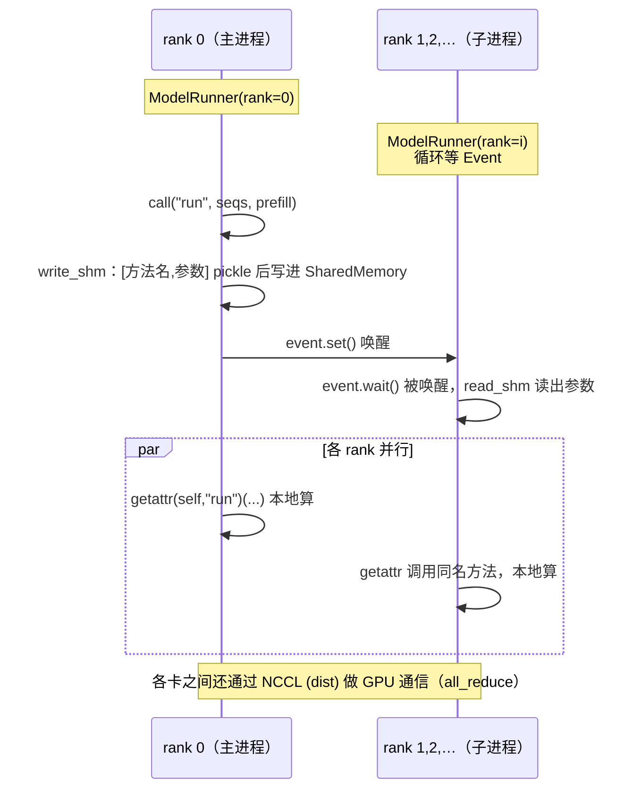

# 第 3 部分 · Python 进阶语法清单：读懂 nano-vllm 所需的语法储备

> 🎯 **本篇目标**：把 nano-vllm 里出现的**每一个 Python 进阶特性**讲清楚——不只是"怎么用"，而是"**底层原理是什么、为什么要这么用**"。读完你既能看懂本项目，也能在工作中熟练运用。
>
> 本篇和前几篇不同：前几篇讲 AI Infra 理论，本篇讲 **Python 语言机制**。我会把每个语法点拆成「是什么 → 底层原理 → 在 nano-vllm 里怎么用 → 极简示例」四段。建议把它当字典，看第 4 部分源码遇到不懂的语法时回来查。

---

## 阅读地图

按主题分五大类，每类若干语法点：

| 类别 | 语法点 | 对应代码 |
|---|---|---|
| **A. 数据建模与类型** | `dataclass`+`slots`、`__post_init__`、`fields()`、类型注解 `X\|None`、`@property`、`Enum`+`auto()` | config / sequence |
| **B. 数据模型协议** | `__len__`/`__getitem__`、`__getstate__`/`__setstate__`（+pickle） | sequence |
| **C. 函数工具与迭代** | 装饰器与 `@classmethod`、`@lru_cache`、`itertools.count`、`deque`、`copy.copy` | sequence / rotary / scheduler |
| **D. 控制流与反射** | `for...else`、解包、`getattr` 反射调用 | scheduler / model_runner |
| **E. 并发与系统** | 多进程 `spawn`+`Event`+`SharedMemory`、`with` 上下文、`global`、`@torch.compile` | llm_engine / model_runner |

---

# A. 数据建模与类型

## A1. `@dataclass` + `slots=True`：自动生成样板代码

### 是什么

定义一个"数据类"（主要用来装数据的类），`@dataclass` 装饰器会**自动**帮你生成 `__init__`、`__repr__`、`__eq__` 等方法，省得手写一堆 `self.x = x`。

```python
from dataclasses import dataclass

@dataclass(slots=True)
class Config:
    model: str
    max_num_seqs: int = 512
```

等价于手写：

```python
class Config:
    def __init__(self, model, max_num_seqs=512):
        self.model = model
        self.max_num_seqs = max_num_seqs
    def __repr__(self): ...
    def __eq__(self, other): ...
```

### 底层原理：`slots=True` 为什么省内存

这是重点。普通 Python 对象把所有属性存在一个叫 `__dict__` 的字典里：

```
普通对象:  实例 → __dict__ (一个 hash 表) → {model: ..., max_num_seqs: ...}
                                       ↑ 字典本身有开销（hash表、额外指针）
                                       ↑ 而且允许运行时随便加新属性
```

`slots=True` 告诉解释器："这个类的属性是**固定**的，就是列出来的这几个"。解释器就**不创建 `__dict__`**，而是用一组**固定槽位**（基于 `__slots__`）存属性：

```
slots 对象: 实例 → [槽0: model][槽1: max_num_seqs]   ← 连续数组，无字典开销
                  ↑ 也禁止运行时加新属性（更安全）
```

好处：① **省内存**（每个实例少一个 dict，属性多/实例多时显著）；② **访问更快**（数组索引 vs hash 查找）；③ **防止拼写错误的新属性**。

### 在 nano-vllm 里

[`config.py`](../nanovllm/config.py)、[`sampling_params.py`](../nanovllm/sampling_params.py)、[`context.py`](../nanovllm/utils/context.py) 全用了 `@dataclass(slots=True)`。这些类实例可能频繁创建（`Context` 每步重建），用 slots 更省更快。

## A2. `__post_init__`：构造后的"收尾钩子"

### 是什么 + 原理

`@dataclass` 生成的 `__init__` 在给所有字段赋值后，会自动调用 `__post_init__(self)`。它给你一个"在所有字段都赋好值之后、再做点事"的钩子。常用于**参数校验**、**派生字段计算**。

```python
@dataclass(slots=True)
class Config:
    model: str
    ...
    def __post_init__(self):
        assert os.path.isdir(self.model)            # 校验
        self.hf_config = AutoConfig.from_pretrained(self.model)  # 派生字段
        self.max_model_len = min(self.max_model_len, self.hf_config.max_position_embeddings)
```

### 在 nano-vllm 里

[`Config.__post_init__`](../nanovllm/config.py) 做了三件事：断言校验（路径存在、块大小、TP 数）、加载 HuggingFace config、裁剪 `max_model_len`。[`SamplingParams.__post_init__`](../nanovllm/sampling_params.py) 则断言 `temperature > 1e-10`（第 2c 部分讲过，禁止贪心采样）。

## A3. `fields()`：运行时反射字段

### 是什么

`dataclasses.fields(cls)` 返回这个 dataclass 的所有字段元信息列表。可以用来在运行时"问一个 dataclass 它有哪些字段"。

```python
from dataclasses import fields
config_fields = {field.name for field in fields(Config)}   # {'model', 'max_num_seqs', ...}
```

### 在 nano-vllm 里：优雅地过滤 kwargs

[`LLMEngine.__init__`](../nanovllm/engine/llm_engine.py) 接收 `**kwargs`，但只把**属于 Config 的**传给 Config：

```python
config_fields = {field.name for field in fields(Config)}
config_kwargs = {k: v for k, v in kwargs.items() if k in config_fields}
config = Config(model, **config_kwargs)
```

这样用户传 `LLM(path, enforce_eager=True, tensor_parallel_size=2, 某个不认识的参数=...)` 时，不认识的参数不会让 `Config` 报错——这是很 Pythonic 的"白名单过滤"。

## A4. 类型注解新语法：`X | None`、`list[int]`

### 是什么 + 原理

Python 3.9+ 可以用内置类型直接做泛型：`list[int]`（代替 `List[int]`）；3.10+ 可以用 `|` 表示联合类型：`X | None`（代替 `Optional[X]`）。

```python
hf_config: AutoConfig | None = None      # 等价于 Optional[AutoConfig]
def schedule(self) -> tuple[list[Sequence], bool]: ...   # 等价于 Tuple[List[Sequence], bool]
```

⚠️ 重要认知：**类型注解在运行时默认不强制**（除非用 mypy 等静态检查工具）。它们主要是给人和工具看的"文档"。`X | None` 只是说"这个变量可以是 X 或 None"，运行时传错类型 Python 不会拦你。

### 在 nano-vllm 里

类型注解遍布所有文件，是代码可读性的重要部分。读源码时，注解能帮你快速理解函数签名。

## A5. `@property`：把"方法"伪装成"属性"

### 是什么 + 原理

`@property` 让你把一个**方法**当作**只读属性**来访问。调用时不用加括号。常用于"需要计算、但对外像属性"的场景。

```python
class Sequence:
    @property
    def num_blocks(self):           # 定义时是方法
        return (self.num_tokens + self.block_size - 1) // self.block_size

seq.num_blocks   # 访问时像属性，不用 seq.num_blocks()
```

底层：`@property` 实现了**描述符协议**，拦截属性访问，把它转发给方法调用。

### 在 nano-vllm 里

[`Sequence`](../nanovllm/engine/sequence.py) 大量用 `@property`：`is_finished`、`num_completion_tokens`、`prompt_token_ids`、`num_blocks`、`last_block_num_tokens`。这些值都是从其他字段**派生**出来的，每次访问现算（不值得存），用 property 最合适。

## A6. `Enum` + `auto()`：类型安全的枚举

### 是什么

`Enum` 定义一组有名字的常量。`auto()` 自动给每个成员分配值（不用手写 1,2,3）。

```python
from enum import Enum, auto

class SequenceStatus(Enum):
    WAITING = auto()      # 值自动 = 1
    RUNNING = auto()      # 值自动 = 2
    FINISHED = auto()     # 值自动 = 3
```

好处：① 用名字（`SequenceStatus.RUNNING`）代替魔法数字（`2`），代码可读；② 拼写错误能在定义时发现；③ 枚举成员是单例，比较用 `is` 都行。

### 在 nano-vllm 里

[`SequenceStatus`](../nanovllm/engine/sequence.py) 是序列的状态机，调度器靠它判断序列处于哪个阶段。`auto()` 让你不必关心具体数字，只关心名字。

---

# B. 数据模型协议

Python 的"数据模型"：你定义一些**双下划线方法**（dunder methods），Python 内置函数/语法就会自动调用它们。这叫"协议"——你实现协议，就获得相应能力。

## B1. `__len__` / `__getitem__`：让对象支持 `len()` 和 `[]`

### 是什么 + 原理

- 实现 `__len__`，你的对象就能用 `len(obj)`。
- 实现 `__getitem__`，你的对象就能用 `obj[key]`、`obj[a:b]`，并且**自动可迭代**（for 循环、`in` 等会调用它）。

```python
class Sequence:
    def __len__(self):
        return self.num_tokens          # len(seq) = 序列长度
    def __getitem__(self, key):
        return self.token_ids[key]      # seq[3] 或 seq[0:256]

seq = Sequence([1,2,3,4,5])
len(seq)      # 5
seq[2]        # 3
seq[1:4]      # [2,3,4]
for t in seq: ...   # __getitem__ 让它可迭代
```

### 在 nano-vllm 里

[`Sequence`](../nanovllm/engine/sequence.py) 实现这两个，让 Sequence 用起来像 list：`len(seq)` 取长度，`seq[start:end]` 切片取 token。这让 model_runner 里 `seq[start:end]` 读起来很自然（[`prepare_prefill`](../nanovllm/engine/model_runner.py) 里 `input_ids.extend(seq[start:end])`）。

## B2. `__getstate__` / `__setstate__`：自定义序列化（+ pickle 原理）⭐

这是本篇最值得深入的一点。

### 背景：pickle 协议

Python 的 `pickle` 能把任意对象**序列化**成字节流（用于存盘、或跨进程传输）。它的机制：

```
对象 ──pickle.dumps──▶ 字节流 ──(传输)──▶ 字节流 ──pickle.loads──▶ 对象副本
                  默认序列化: 对象的 __dict__（所有属性）
```

默认情况下，pickle 序列化对象的**整个 `__dict__`**（所有实例属性）。但有时你想**自定义**——比如只序列化一部分字段，或序列化时做转换。

### `__getstate__` / `__setstate__` 协议

- `__getstate__(self)`：pickle 调用它拿到"要序列化的状态"。返回什么，就序列化什么。
- `__setstate__(self, state)`：反序列化时调用，`state` 是 `__getstate__` 返回的那个东西，用来**重建对象**。

### nano-vllm 为什么自定义它：省多进程传输量 ⭐

[`Sequence`](../nanovllm/engine/sequence.py) 在多进程张量并行时，要被 `pickle` 从 rank 0 传给其他 rank。但 decode 阶段，Sequence 的 `token_ids` 可能很长（几千个 token），**全传过去又慢又浪费**——因为其他 rank 只需要 `last_token`（最后一个 token）来算！

```python
def __getstate__(self):
    last_state = self.last_token if not self.is_prefill else self.token_ids
    return (self.num_tokens, self.num_prompt_tokens, self.num_cached_tokens,
            self.num_scheduled_tokens, self.block_table, last_state)

def __setstate__(self, state):
    self.num_tokens, ... = state
    if isinstance(last_state, list):        # prefill: 需要完整 token_ids
        self.token_ids = last_state
        self.last_token = self.token_ids[-1]
    else:                                    # decode: 只需要 last_token！
        self.token_ids = []
        self.last_token = last_state
```

**精妙之处**：

- **Prefill** 时（`is_prefill=True`），其他 rank 需要完整 prompt 来算，所以传完整 `token_ids`。
- **Decode** 时（`is_prefill=False`），其他 rank 只需要最后一个 token 来预测下一个，所以**只传一个 `last_token`**，`token_ids` 置空！

```
Decode 阶段，不优化:  传 [t0,t1,...,t9999] 共 10000 个 int  ← 慢
Decode 阶段，优化后:  传 t9999 共 1 个 int                   ← 快 10000 倍
```

这是**理解 pickle 协议做性能优化**的绝佳案例。第 4 部分精讲 sequence.py 时会再细化。

---

# C. 函数工具与迭代

## C1. 装饰器与 `@classmethod`

### 装饰器原理

装饰器本质：**一个接收函数、返回新函数**的函数。`@decorator` 是语法糖：

```python
@decorator
def f(): ...
# 等价于:
def f(): ...
f = decorator(f)
```

### `@classmethod`

`@classmethod` 把方法绑定到**类**而不是实例。它的第一个参数是**类本身**（约定叫 `cls`），不是实例（`self`）。常用于"替代构造器"（factory method）。

```python
class BlockManager:
    @classmethod
    def compute_hash(cls, token_ids, prefix=-1):   # cls = BlockManager
        ...   # 不需要实例就能调用: BlockManager.compute_hash(...)
```

### 在 nano-vllm 里

[`BlockManager.compute_hash`](../nanovllm/engine/block_manager.py) 是 classmethod——它是个纯工具函数，不需要访问实例状态，但逻辑上属于 BlockManager，所以挂在类上并用 classmethod（不实例化也能调）。

## C2. `@functools.lru_cache`：记忆化/单例缓存

### 原理

`lru_cache` 给函数加**记忆化（memoization）**：相同参数的调用只算一次，结果缓存起来，下次直接返回。LRU = Least Recently Used，缓存满了淘汰最久没用的。

```python
from functools import lru_cache

@lru_cache(1)          # 缓存容量 1（只记住最近 1 组参数的结果）
def get_rope(head_size, rotary_dim, max_position, base):
    return RotaryEmbedding(head_size, rotary_dim, max_position, base)
```

### 在 nano-vllm 里：用 lru_cache 实现"全局单例"

[`get_rope`](../nanovllm/layers/rotary_embedding.py) 用 `@lru_cache(1)`。为什么？Qwen3 模型每一层的 RoPE 参数完全相同，但每层构造时会调 `get_rope(...)`。加了 lru_cache 后，**所有层共用同一个 `RotaryEmbedding` 实例**（同一个 cos/sin 表），不重复创建、不重复占显存。

```
没有 lru_cache:  28 层 × 各创建一个 RotaryEmbedding → 28 份相同的 cos/sin 表  😱
有了 lru_cache:  第一次调用创建，后面 27 次直接返回同一个 → 1 份表  ✅
```

这是用标准库实现"参数化单例"的优雅技巧。

## C3. `itertools.count`：无限自增计数器

### 原理

`count(start)` 返回一个**无限迭代器**，每次 `next()` 给出 start, start+1, start+2, ... 永不停止。它是**惰性**的（不会一次性生成无穷个数，按需生成）。

```python
from itertools import count
counter = count()
next(counter)   # 0
next(counter)   # 1
next(counter)   # 2 ...
```

### 在 nano-vllm 里：全局唯一 ID 生成

```python
class Sequence:
    counter = count()        # 类属性，所有实例共享
    def __init__(self, ...):
        self.seq_id = next(Sequence.counter)   # 每个新序列拿一个唯一递增 id
```

[`Sequence.counter = count()`](../nanovllm/engine/sequence.py) 保证每个序列有全局唯一、递增的 `seq_id`，用于追踪和排序结果。

## C4. `collections.deque`：双端队列

### 原理 + 为什么比 list 强

`deque`（double-ended queue）两端都支持 $O(1)$ 的插入/删除。而 `list` 在**头部**插入/删除是 $O(n)$（要移动后面所有元素）。

```
list:  [0,1,2,3]
  pop(0) / insert(0, x)  → O(n)  (要整体移位)  ❌
  append / pop()         → O(1)  (尾部)        ✅

deque:  ↔ [0,1,2,3] ↔
  popleft / appendleft  → O(1)  ✅
  append / pop          → O(1)  ✅
```

### 在 nano-vllm 里

调度器用 `deque` 当队列（[`scheduler.py`](../nanovllm/engine/scheduler.py)）：

- `waiting: deque[Sequence]` —— 等候队列，`popleft()`（FIFO 取最早请求）、`appendleft()`（被抢占的序列从 `running` 踢回来、插到队首优先重排）。
- `running: deque[Sequence]` —— 进行中队列。
- [`extendleft(reversed(scheduled_seqs))`](../nanovllm/engine/scheduler.py)：把一批序列按原顺序放回 running 队首。注意必须 `reversed`——因为 `extendleft` 会**逆序**逐个从左插入，加个 `reversed` 正好抵消，保持原顺序。

[`block_manager.py`](../nanovllm/engine/block_manager.py) 的 `free_block_ids` 也用 deque：`popleft()` 分配、`append()` 回收，FIFO 复用（让刚释放的块晚点被重用，利于 prefix cache）。

## C5. `copy.copy`：浅拷贝

### 原理

`copy.copy(x)` 创建 x 的**浅拷贝**——新对象，但内部的元素还是**共享引用**（不复制内部）。

```python
import copy
a = [1, 2, [3, 4]]
b = copy.copy(a)
b is a            # False（新对象）
b[2] is a[2]      # True（内部列表共享）
```

对比 `copy.deepcopy`：深拷贝会递归复制所有内部对象。

### 在 nano-vllm 里

[`Sequence.__init__`](../nanovllm/engine/sequence.py)：`self.token_ids = copy(token_ids)`。为什么要拷贝？因为传进来的 `token_ids` 可能是调用方的 list，Sequence 后续会 `append_token` 修改它。如果不拷贝，会**意外修改调用方的数据**。浅拷贝足够（里面是 int，不可变）。

---

# D. 控制流与反射

## D1. `for...else`：循环"自然结束"时执行 else ⭐（冷门但项目在用）

### 是什么

Python 有个冷门语法：`for...else`。`else` 块在循环**正常结束**（没被 `break` 打断）时执行。

```python
for x in items:
    if 满足条件(x):
        做事()
        break
else:
    # 循环走完了都没 break
    全都不满足时的事()
```

> 记忆：`else` 在这里更像是 "no break"（没中断）的意思。

### 在 nano-vllm 里：嵌套查找 + "没找到则默认处理"

[`loader.py`](../nanovllm/utils/loader.py) 加载权重时，对每个权重名，先在 `packed_modules_mapping` 里找匹配项；找到了就 `break`（用特殊 loader）；**都没匹配**就走 `else`（用默认 loader）：

```python
for k in packed_modules_mapping:
    if k in weight_name:
        ...   # 特殊处理（打包权重）
        break
else:
    param = model.get_parameter(weight_name)
    weight_loader = getattr(param, "weight_loader", default_weight_loader)   # 默认处理
    weight_loader(param, f.get_tensor(weight_name))
```

[`scheduler.py`](../nanovllm/engine/scheduler.py) decode 段也有类似 `while...else`：抢占循环 `while not can_append:` 里不停 `preempt` 腾显存；一旦 `can_append` 变 True（循环条件变假、没被 break），就执行 `else`（成功拿到块，正常 append）。

## D2. 解包：`method_name, *args = ...`

### 是什么

Python 解包：把一个序列拆开赋值。`*` 收集"剩下的"成 list。

```python
a, *b = [1, 2, 3, 4]      # a=1, b=[2,3,4]
method_name, *args = ["run", seqs, True]   # method_name="run", args=[seqs, True]
```

### 在 nano-vllm 里：跨进程"远程调用"协议

[`model_runner.read_shm`](../nanovllm/engine/model_runner.py) 从共享内存读出 `[方法名, 参数1, 参数2, ...]`：

```python
method_name, *args = pickle.loads(self.shm.buf[4:n+4])   # 拆成方法名 + 参数列表
self.call(method_name, *args)                             # 反射调用
```

这其实是一个迷你的"远程过程调用（RPC）"协议——用解包优雅地把"方法名和参数"分离。

## D3. `getattr`：反射式调用 ⭐

### 是什么 + 原理

`getattr(obj, name)` 等价于 `obj.name`，但 `name` 是**字符串**。这叫**反射**——在运行时用字符串决定访问哪个属性/方法。`getattr(obj, name, default)` 找不到时返回 default。

```python
getattr(obj, "run")        # 等价 obj.run
getattr(obj, "run", None)  # 没有 run 属性就返回 None
```

### 在 nano-vllm 里：字符串驱动的"调度"

[`ModelRunner.call`](../nanovllm/engine/model_runner.py) 是张量并行的核心——rank 0 把"要调的方法名"通过共享内存广播给其他 rank，所有 rank 用 `getattr` 按字符串调用同名方法：

```python
def call(self, method_name, *args):
    if self.world_size > 1 and self.rank == 0:
        self.write_shm(method_name, *args)          # rank0 广播方法名+参数
    method = getattr(self, method_name, None)        # 所有 rank: 按字符串取方法
    return method(*args)                             # 调用
```

这样 `runner.call("run", seqs, is_prefill)` 和 `runner.call("exit")` 用同一个机制——`getattr` 让"方法名"成了可传输的数据。这是 Python 动态特性在分布式系统里的巧妙应用。

---

# E. 并发与系统

## E1. 多进程：`spawn` + `Process` + `Event` + `SharedMemory` ⭐（本篇最复杂）

nano-vllm 的张量并行用 **多进程** 实现（每张 GPU 一个进程）。这是本篇最值得深入的部分。

### 为什么用 `spawn` 而不是 `fork`

Python 多进程有两种启动方式：

| 方式 | 机制 | 问题 |
|---|---|---|
| `fork`（Linux 默认） | 复制父进程的整个内存（写时复制） | **CUDA 状态不能 fork**！fork 后子进程的 CUDA 会损坏 |
| `spawn` | 重新启动一个 Python 解释器，重新导入、重新初始化 | 干净，但慢一点（要重新 import） |

nano-vllm 显式用 `spawn`（[`llm_engine.py`](../nanovllm/engine/llm_engine.py)）：`ctx = mp.get_context("spawn")`。**因为涉及 CUDA，必须 spawn，不能 fork**。这是 GPU 编程的重要常识。

### 四件套协作流程

```python
ctx = mp.get_context("spawn")
for i in range(1, tensor_parallel_size):
    event = ctx.Event()                                    # 同步事件
    process = ctx.Process(target=ModelRunner, args=(config, i, event))
    process.start()
    self.events.append(event)
self.model_runner = ModelRunner(config, 0, self.events)    # rank0 在主进程
```

四件套各自的角色：



> 📡 **这张图怎么读**：这是一张**时序图（sequence diagram）**，和前面的流程图不同：两条竖线代表两个参与者（rank0 主进程、rank i 子进程），**从上到下是时间流逝**，横向箭头是"谁通知谁 / 谁干什么"，`par ... end` 框表示"这一段两边在并行"。
>
> - **背景**：Tensor Parallelism（张量并行）需要多张 GPU 卡同时算同一个模型的不同部分，每张卡由一个独立进程（rank）管理，rank0 是"主"、其余是"子"。
> - **主进程发起**：rank0 决定要调什么方法（如 `run`），把"方法名 + 参数"打包（pickle）写进共享内存（SharedMemory），再 `event.set()` 按铃通知。
> - **子进程响应**：子进程一直在 `event.wait()` 等铃响；一响就读共享内存拿参数，用 `getattr` 调用**同名方法**——也就是说**所有 rank 跑同一段代码，只是各算各的那份数据**。
> - **并行计算**：`par` 框里两边各自本地算（rank0 算它的份、子进程算它们的份），互不阻塞。
> - **跨卡同步**：算完后各卡通过 **NCCL** 做 GPU 通信（如 all_reduce 把各卡结果合并）——这就是图底部的横向 Note。
>
> 🍳 **类比**：rank0 像班长大喇叭喊"现在做第 3 题，参数是这些（写黑板/共享内存）"，各同学（子进程）听到后**同时**各做各的卷子（本地算），最后把答案对一对合并（NCCL）。

| 组件 | 干什么 |
|---|---|
| **`Process`** | 开一个独立进程跑 rank i 的 ModelRunner |
| **`SharedMemory`** | 一块多进程**共享的内存**，rank0 把方法名+参数写进去，其他 rank 读出来（比队列/管道更适合传大一点的 pickle 数据） |
| **`pickle`** | 把 Python 对象（如 Sequence 列表）序列化成字节写进共享内存 |
| **`Event`** | 进程间**同步信号**：rank0 `event.set()` 通知"数据写好了"，其他 rank `event.wait()` 阻塞等待唤醒 |

### 为什么这么设计

- 每个 rank 是独立进程，各有自己的 CUDA context，互不干扰。
- rank0 是"主控"，决定调哪个方法；其他 rank 进入 `loop()`（[`model_runner.py`](../nanovllm/engine/model_runner.py)），被动等指令。
- GPU 之间的真正数据通信（all_reduce 等）走 **NCCL**（`dist`），不经过共享内存——共享内存只传**控制信息**（方法名、Sequence 元数据），NCCL 传**张量数据**。这个分工很关键。

> 🔬 这套机制把"多进程控制"和"GPU 集合通信"分离，是个很干净的 TP 实现。第 4 部分精讲 model_runner 时会逐行走一遍。

## E2. `with`：上下文管理器

### 原理

`with obj as x:` 会在进入时调用 `obj.__enter__()`（返回值赋给 x），在退出时**自动调用** `obj.__exit__()`（即使抛异常也会）。用于"获取-释放"资源（文件、锁、GPU graph）。

```python
with open("f.txt") as f:     # __enter__ 打开文件
    data = f.read()
# 自动 __exit__ 关闭文件，即使 read 抛异常也关
```

### 在 nano-vllm 里

- [`loader.py`](../nanovllm/utils/loader.py)：`with safe_open(file, "pt", "cpu") as f:` —— safetensors 的上下文，保证文件正确关闭、支持懒加载。
- [`model_runner.py`](../nanovllm/engine/model_runner.py)：`with torch.cuda.graph(graph, self.graph_pool):` —— CUDA Graph 录制的上下文，进入开始录制、退出结束录制。

## E3. `global`：跨函数共享全局状态

### 原理

函数内部默认只能**读**外层变量；想**修改**模块级变量，要声明 `global`。

```python
_CONTEXT = Context()       # 模块级变量

def set_context(...):
    global _CONTEXT        # 声明：我要修改全局的 _CONTEXT
    _CONTEXT = Context(...)

def get_context():
    return _CONTEXT        # 只读，不需要 global
```

### 在 nano-vllm 里：全局上下文传递 attention 参数

[`context.py`](../nanovllm/utils/context.py) 用一个模块级全局变量 `_CONTEXT` 存当前推理的上下文（is_prefill、cu_seqlens、slot_mapping 等）。这样 attention 层在任意深度都能 `get_context()` 拿到当前参数，**不必把一堆参数层层传递**——这是个有争议但简洁的设计（用全局避免长参数链）。第 4 部分会讨论它的利弊。

## E4. `@torch.compile` / `@torch.inference_mode`（PyTorch 装饰器）

虽然不是 Python 标准库，但项目里大量出现：

- `@torch.compile`：第 2c 部分讲过，编译融合算子。
- `@torch.inference_mode()`（[`model_runner.run_model`](../nanovllm/engine/model_runner.py)）：相当于 `@torch.no_grad()` 的进阶版——告诉 PyTorch"我只要推理，不要记梯度"，省掉反向传播的记账开销，更快更省显存。推理引擎必备。

---

## 本篇小结

你现在掌握了 nano-vllm 涉及的**全部 Python 进阶语法**，以及它们底层的原理：

- **数据建模**：`@dataclass(slots=True)` 自动生成代码 + 省内存；`__post_init__` 校验/派生；`fields()` 反射过滤；`@property` 派生属性；`Enum+auto` 状态机。
- **数据模型协议**：`__len__/__getitem__` 让对象像 list；`__getstate__/__setstate__` 自定义 pickle，nano-vllm 借此**只传 last_token 省万倍传输**。
- **函数工具**：装饰器/`classmethod`、`lru_cache` 实现参数化单例、`itertools.count` 全局 ID、`deque` 双端 O(1)、`copy.copy` 浅拷贝。
- **控制流与反射**：`for...else`（没 break 才执行）、解包、`getattr` 字符串驱动调用。
- **并发与系统**：多进程 `spawn`（CUDA 不能 fork）+ Event + SharedMemory + pickle 的 TP 通信机制；`with` 资源管理；`global` 全局上下文。

### 📍 整体进度

```
[第0部分] ✅ ➜ [第1部分] ✅ ➜ [第2部分 2a/2b/2c] ✅ ➜ [第3部分 Python 语法] ✅你在这里
                                                              │
                                                              ▼
                                          [第4部分 逐文件精讲] ➜ [第5部分 动手实践]
```

> **下一篇预告（第 4 部分）**：回到代码本身，按 [第 0 部分给的阅读顺序](00-导论.md)，**逐文件、逐函数**精讲。届时，前面学的所有 AI Infra 理论（第 2 部分）和 Python 语法（第 3 部分）都会一一对应到具体代码行——你会发现"原来这段代码就是在实现 XX 理论"。

---

> 📌 第 4 部分是"理论落地代码"的收官篇，会按入口→引擎→执行→模型→算子的顺序逐文件拆。继续吗？
